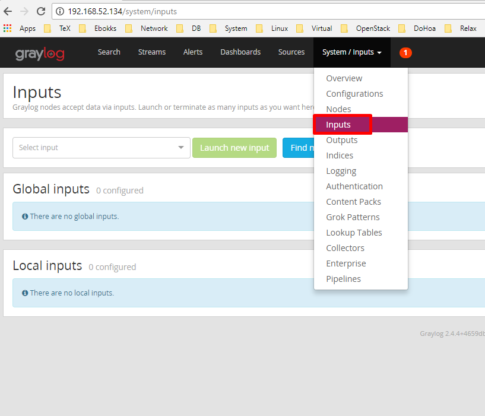
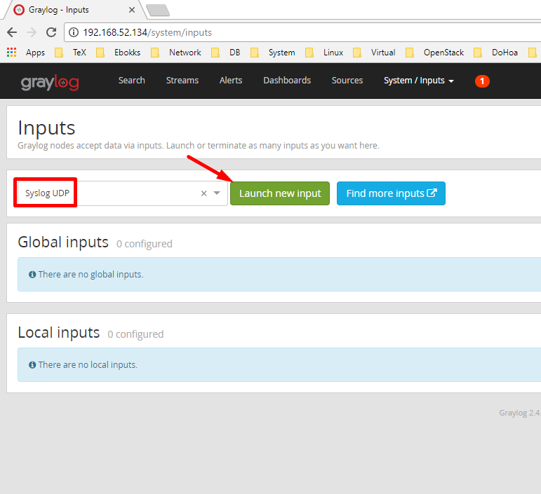
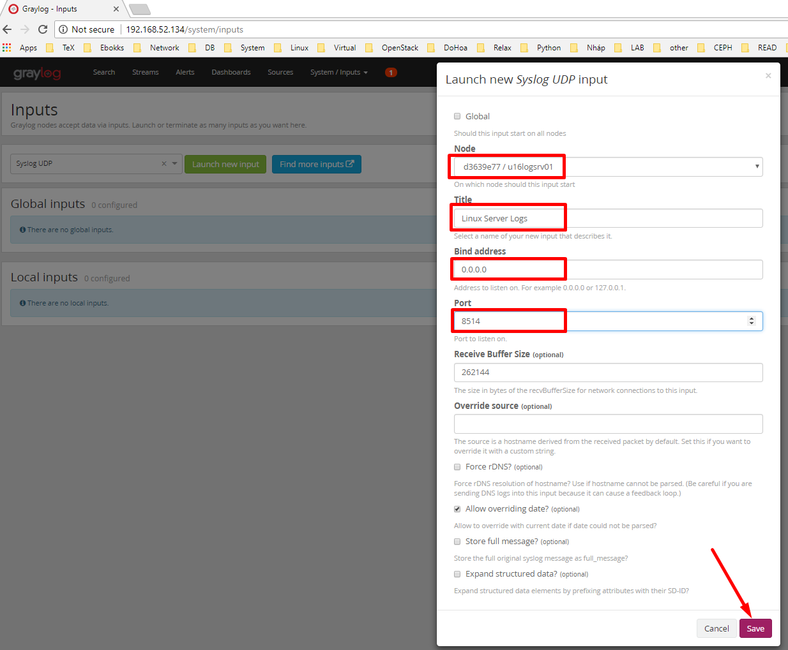
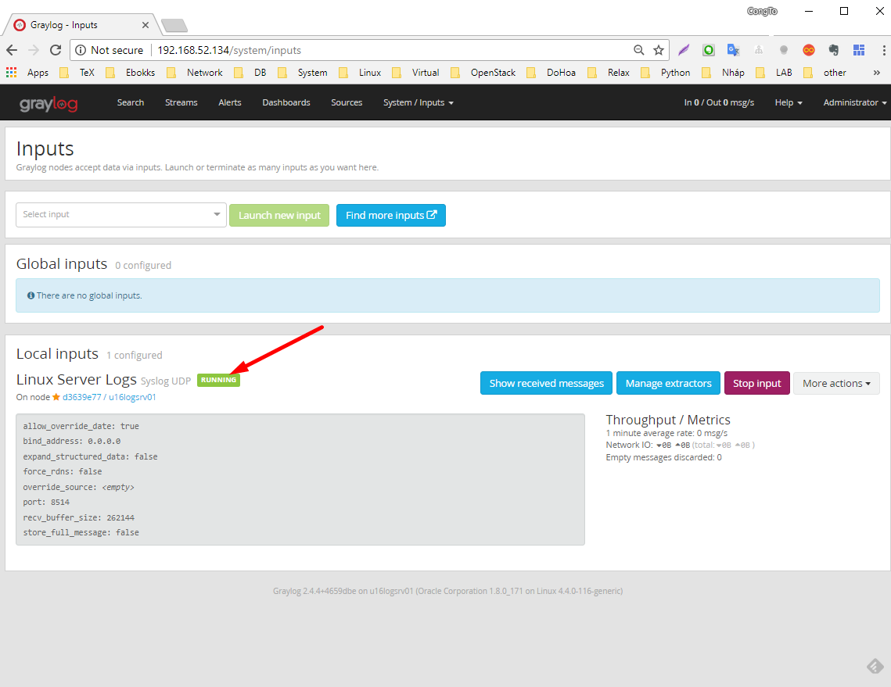
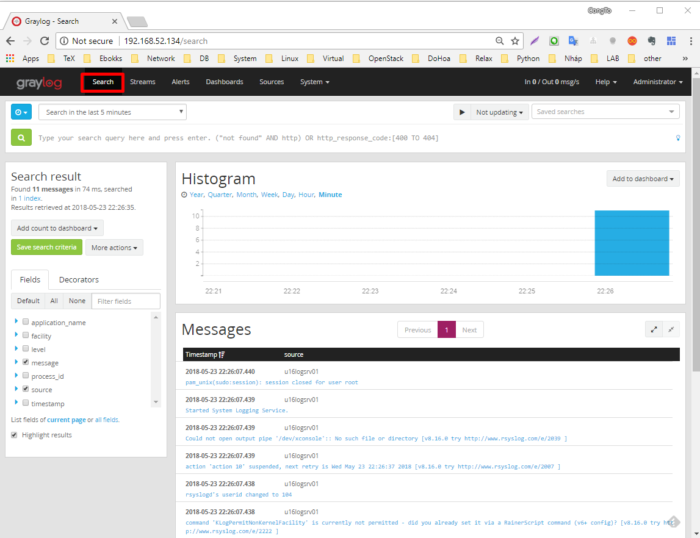

## Ghi chép về cài đặt graylog

- Các bước cài đặt graylog
- Tham khảo

  1. https://www.vultr.com/docs/how-to-install-graylog-server-on-ubuntu-16-04
	
  2. https://computingforgeeks.com/how-to-install-graylog-2-4-with-elasticsearch-5-x-on-centos-7/

### 1. Môi trường

#### 1.1. Các yêu cầu

- OS Server: Ubuntu server 64 bit 16.04
- Graylog 2.4.4
- MongoDB version 3.x 
- Elasticsearch version 5.6.x
- Thực hiện với quyền `root`

#### 1.2. Mô hình

#### 1.3. IP Planning

### 2. Các bước cài đặt trên server.

#### 2.1. Cấu hình hostname và địa chỉ IP.


#### 2.2. Cài đặt các gói cơ bản.

##### 2.2.1. Cài đặt JAVA

- Chuyển sang quyền `root` (nếu chưa có tài khoản root và mật khẩu thì tìm google để đặt cho Ubuntu).

	```sh
	su -
	```

- Cài đặt java

	```sh
	sudo apt-get -y install software-properties-common

	sudo add-apt-repository -y ppa:webupd8team/java

	sudo apt-get update

	sudo apt -y install oracle-java8-installer
	```

- Nhấn `Enter` với và `Yes` khi màn hình hiển thị ra. Sau đó chờ để máy chủ cài đặt Java và chuyển sang bước tiếp để kiểm tra phiên bản của java. 

	```sh
	java -version
	```

  - Kết quả: http://prntscr.com/jlib82
	
	
- Thiết lập biến môi trường `JAVA_HOME` cho OS bằng cách cài gói dưới

	```sh
	sudo apt -y install oracle-java8-set-default
	```

- Đăng nhập với phiên SSH mới và chuyển sang quyền `root`

	```sh
	su - 
	```

- Kiểm tra lại xem biến `JAVA_HOME` đã được thiết lập hay chưa bằng lệnh `echo $JAVA_HOME` và kết quả là:

	```sh
	echo $JAVA_HOME
	```
	
	- Kết quả: http://prntscr.com/jliea9


##### 2.2.2. Cài đặt Elasticsearch

- Thực hiện các bước dưới để cài đặt Elastic

	```sh
	echo "deb https://artifacts.elastic.co/packages/5.x/apt stable main" | sudo tee -a /etc/apt/sources.list.d/elastic-5.x.list

	wget -qO - https://artifacts.elastic.co/GPG-KEY-elasticsearch | sudo apt-key add -

	apt-get install apt-transport-https
	
	sudo apt-get -y update

	sudo apt-get -y install elasticsearch
	```

- Cấu hình Elastic cho Gray log sử dụng

- Sao lưu file cấu hình của graylog trước khi sửa.

	```cp
	cp /etc/elasticsearch/elasticsearch.yml /etc/elasticsearch/elasticsearch.yml.orig
	```

- Sửa dòng `#cluster.name: my-application` thành dòng `cluster.name: graylog` trong file /etc/elasticsearch/elasticsearch.yml


	```sh
	sed -i 's/#cluster.name: my-application/cluster.name: graylog/g' /etc/elasticsearch/elasticsearch.yml
	```


- Thực hiện kích hoạt và khởi động Elasticsearch 

	```sh
	sudo systemctl enable elasticsearch
	sudo systemctl start elasticsearch
	```
	
- Nếu cần kiểm tra lại trạng thái hoạt động của Elasticsearch thì thực hiện các lệnh dưới.

	```sh
	sudo systemctl status elasticsearch
	```

- Thực hiện lệnh dưới để kiểm tra kết quả của Elasticsearch

	```sh
	curl -XGET 'localhost:9200/?pretty'
	```

- Kết quả trả về như bên dưới, ta thấy dòng version là 5.6.9 là phiên bản của Elasticsearch, lưu ý Graylog 2.4.x chỉ hoạt động với phiên bản Elasticsearch 5.x, nếu thấp hoặc cao hơn thì cần xem lại các bước cài đặt.

	```sh
	root@u16logsrv01:~# curl -XGET 'localhost:9200/?pretty'
	{
		"name" : "uXyOb8A",
		"cluster_name" : "graylog",
		"cluster_uuid" : "FPS4E3XMRti9wJP5KKlYsg",
		"version" : {
			"number" : "5.6.9",
			"build_hash" : "877a590",
			"build_date" : "2018-04-12T16:25:14.838Z",
			"build_snapshot" : false,
			"lucene_version" : "6.6.1"
		},
		"tagline" : "You Know, for Search"
	}
	```	

Nếu trả về thông báo lỗi thì cần xem lại các bước ở bên trên.

##### 2.2.3. Cài đặt MongoDB

- Thực hiện các bước khai báo để cài MongoDB, phiên bản của MongoDB tương thích với `Graylog 2.4.x` là `MongoDB 3.x`
- Khai báo các bước cần thiết trước khi cài MongoDB

	```sh
	sudo apt-key adv --keyserver hkp://keyserver.ubuntu.com:80 --recv 0C49F3730359A14518585931BC711F9BA15703C6


	echo "deb [ arch=amd64,arm64 ] http://repo.mongodb.org/apt/ubuntu xenial/mongodb-org/3.4 multiverse" | sudo tee /etc/apt/sources.list.d/mongodb-org-3.4.list
	
	sudo apt-get -y update	
	```
	
- Thực hiện cài MongoDB

	```sh
	sudo apt -y install mongodb-org
	```

- Khởi động và kích hoạt MongoDB

	```sh
	sudo systemctl start mongod
	sudo systemctl enable mongod
	```


#### 2.3. Cài đặt các gói của graylog và cấu hình.

- Cài đặt Graylog

	```sh
	wget https://packages.graylog2.org/repo/packages/graylog-2.4-repository_latest.deb
	sudo dpkg -i graylog-2.4-repository_latest.deb
	sudo apt-get -y update
	```

- Cài đặt graylog 

	```
	sudo apt-get -y install graylog-server
	```

- Cài đặt tiện ích để sinh ra mật khẩu phức tạp và sử dụng để khai báo cho Graylog

	```sh
	sudo apt-get -y install pwgen
	```

- Sinh chuỗi mật khẩu phức tạp

	```sh
	pwgen -N 1 -s 96
	```

- Kết quả sẽ hiển thị một chuỗi dài 96 ký tự, lưu nó lại để khai báo ở bước dưới. Chuỗi này được khai báo trong dòng `password_secret` ở phần dưới.

- Thực hiện tạo mật khẩu cho tài khoản admin bằng lệnh dưới, lệnh dưới sẽ băm mật khẩu là `Welcome123` để dùng cho tài khoản `admin`, kết quả ở màn hình sẽ khai báo vào dòng `root_password_sha2` ở bên dươi

	```sh
	echo -n Welcome123 | sha256sum
	``` 

- Sao lưu file `/etc/graylog/server/server.conf` trước khi sửa

	```sh
	cp /etc/graylog/server/server.conf /etc/graylog/server/server.conf.orig
	```

- Mở file `/etc/graylog/server/server.conf` và sửa các dòng dưới, nhớ thay các chuỗi tương ứng với các kết quả bạn thu ở bên trên.

```sh
password_secret = pJqhNbdEY9FtNBfFUtq20lG2m9daacmsZQr59FhyoA0Wu3XQyVZcu5FedPZ9eCiDfjdiYWfRcEQ7a36bVqxSyTzcMMx5Rz8v
root_password_sha2 = 05a181f00c157f70413d33701778a6ee7d2747ac18b9c0fbb8bd71a62dd7a223
root_email = congto@hocchudong.com
root_timezone = Asia/Ho_Chi_Minh

```
`
- Tìm tiếp các dòng bên dưới và sửa tương ứng ở file `/etc/graylog/server/server.conf`

	```sh
	rest_listen_uri = http://0.0.0.0:9000/api/
	rest_transport_uri = http://0.0.0.0:9000/api/
	web_enable = true
	web_listen_uri = http://0.0.0.0:9000/
	```
	
- Khởi động và kích hoạt Graylog

```sh
sudo systemctl restart graylog-server
sudo systemctl enable graylog-server
```

- Tới đây, đã có thể truy cập vào web của graylog với địa chỉ: `http://ip_may_chu:9000` với tài khoản là `admin` và mật khẩu là `Welcome123`. Nhưng ta nên setup nginx làm proxy để vào với địa chỉ `http://ip_may_chu` theo các bước tiếp theo.


#### 2.4. Cài đặt nginx làm proxy.

- Cài đặt nginx

```sh
sudo apt -y install nginx
```

- Tìm các dòng tương ứng trong file `/etc/nginx/sites-available/default` và sửa với nội dung  dưới, thay địa chỉ IP cho phù hợp với máy mà bạn cài đặt graylog (lưu ý các dấu đóng mở ngoặc cho đúng).

```sh
server
{
    listen 80 default_server;
    listen [::]:80 default_server ipv6only=on;
    server_name 192.0.2.1 graylog.example.com;

    location / {
      proxy_set_header Host $http_host;
      proxy_set_header X-Forwarded-Host $host;
      proxy_set_header X-Forwarded-Server $host;
      proxy_set_header X-Forwarded-For $proxy_add_x_forwarded_for;
      proxy_set_header X-Graylog-Server-URL http://$server_name/api;
      proxy_pass       http://127.0.0.1:9000;
    }
}
```

- Khởi động và kích hoạt nginx.

	```sh
	sudo systemctl restart nginx
	sudo systemctl enable nginx
	```

- Kiểm tra xem nginx cấu hình đúng hay chưa

	```sh
	nginx -t
	```
	

Truy cập vào địa chỉ IP `http://ip_may_chu`, tài khoản đăng nhập là `admin` và mật khẩu là `Welcome123`.

#### 2.5. Setup cơ bản trên GUI Web của graylog để sẵn sàng cho việc nhận log từ client.

- Trong bước này sẽ setup để Graylog server nhận được log từ chính nó trước, các bước dưới sẽ khai báo thêm cho các client sau.
- Graylog Server có thể nhận log qua nhiều cách, trong phần này hướng dẫn nhận log qua rsyslog thông thường. Các setup sử dụng cách khác sẽ giới thiệu ở mục khác.

##### 2.5.1. Cấu hình để Graylog Server nhận log qua `rsyslog/UDP`

- Đăng nhập vào web server và chọn tab `System/Inputs` =>  `Inputs`



- Trong giao diện tiếp theo, chọn menu `Syslog UDP`, sau đó click `Launch new input`. Sau khi thực hiện sẽ có giao diện tiếp theo.



- Tại cửa sổ mới ta thực hiện các lựa chọn sau:

  - `Node`: Lựa chọn tên node trong menu hiển thị.
	- `Title`: Nhập tên bạn mong muốn, ví dụ: `Linux Server Logs`
	- `Bind address`: Nhập địa chỉ 0.0.0.0 để cho phép tất cả có thể lắng nghe/nhận log trên các interface của máy chủ Graylog khi client gửi tới.
	- `Port`: Nhập 8514 để tránh với port 514 được sử dụng mặc định cho syslog. Nên nhập số lớn hơn 1024.
	


Sau đó chọn `Next`, ta sẽ thấy xuất hiện giao diện bên dưới, nếu xuất hiện `RUNNING` là ok. Chuyển sang bước khai báo trong rsyslog của chính máy Graylog để hiển thị log trên giao diện web.




##### 2.5.2. Thực hiện khai báo rsyslog trên máy graylog để gửi log về server.

- Ta thực hiện cấu hình rsyslog trên chính máy chủ graylog để đẩy log về Graylog. Bước này có thể áp dụng cho các client linux khác để sử dụng cách đẩy log tương tự.

- Nhớ mở port 8514 nếu `ufw` trên Ubuntu đang kích hoạt

	```sh
	sudo ufw allow 8514/udp
	```

- Tạo file `/etc/rsyslog.d/60-graylog.conf` với nội dung dưới.

	```sh
	$template GRAYLOGRFC5424,"<%PRI%>%PROTOCOL-VERSION% %TIMESTAMP:::date-rfc3339% %HOSTNAME% %APP-NAME% %PROCID% %MSGID% %STRUCTURED-DATA% %msg%\n"
	*.* @192.168.52.134:8514;GRAYLOGRFC5424
	```

- Trong đó:

  - 192.168.51.134: là địa chỉ IP của máy graylog trong ví dụ này.
	- `8514`: Là port mà trước đó đã mở cho Graylog server để tránh port 514  mặc định của `rsyslog`.
	- `*.*`: là để chỉ ra đang đẩy log bằng giao thức `UDP`
	- Tham khảo thêm tại: https://marketplace.graylog.org/addons/a47beb3b-0bd9-4792-a56a-33b27b567856 

	
- Khởi động lại `rsyslog` và bắt đầu kiểm tra trên web.

	```sh
	sudo systemctl restart rsyslog
	```

- Mặc định rsyslog sẽ quản lý các file log mặc định trong Linux server và đẩy về cho Graylog, muốn lấy các log của ứng dụng khác thì có thể cần cấu hình để rsyslog quản lý chúng trước nhé.
- Ngoài ra - Graylog còn hỗ trợ rất nhiều phương pháp nhận log từ client khác. Hãy xem thêm các tài liệu khác để biết cách cấu hình.

- Vào web của Graylog, sau đó vào tab `Search`, ta có kết quả dưới. Cần thiết thì trước khi vào thử ssh đúng hoặc sai trước để có log xuất hiện.



- Tới đây có thể chuyển sang bước khai báo thêm client, hoặc các bước setup dashboard trên graylog theo ý muốn.


### 3. Các bước cài đặt trên Client