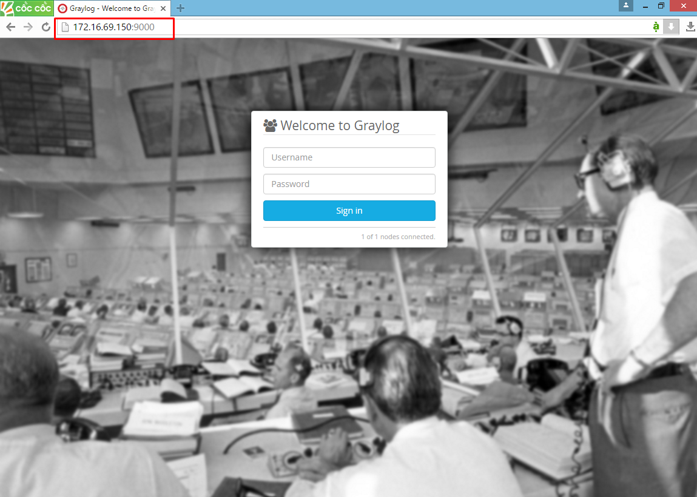

# Script cài đặt GRAYLOG V.1.3

### INFO
```sh
# Graylog V1.3
# Elasticsearch 1.7
# MongoDB 2.6.11
# Ubuntu 14.04.2
# Update: 13/03/2016
```

#### DIAGRAM LAB
*** 


3 bước cài đặt và cấu hình cho Graylog
#### Chạy Script
*** 
Bước 1: Cài Graylog Server 
```sh
wget https://raw.githubusercontent.com/hocchudong/ghichep-graylog/master/graylog/graylog-scripts/graylog-server.sh
bash graylog-server.sh

```

Bước 2 : Cài đặt Collector cho Client 
```sh
wget https://raw.githubusercontent.com/hocchudong/ghichep-graylog/master/graylog/graylog-scripts/graylog-collector.sh
bash graylog-collector.sh
```
Sau khi chạy Script, nhập thông tin các file log cần lấy. Tham khảo bài Step 4 của bài [sau](https://github.com/hocchudong/ghichep-graylog/tree/master/graylog/graylog-collector)

Bước 3 : Hướng dẫn cấu hình Input trên WEB interface của Graylog

Đăng nhập WEB interface


Tham khảo link [sau](https://github.com/hocchudong/ghichep-graylog/blob/master/graylog/graylog-collector/GELF%20Input%20for%20graylog-collector.md) để cài đặt INPUT

Kiểm tra các source log
 

