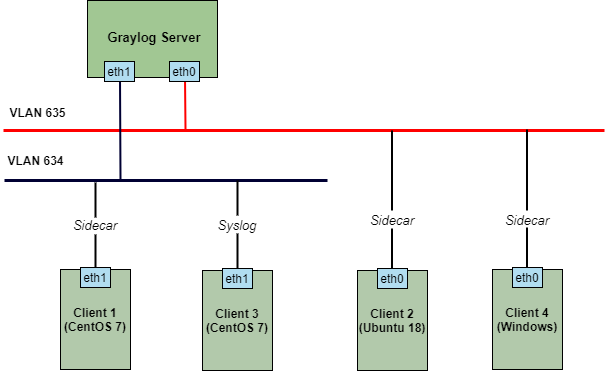
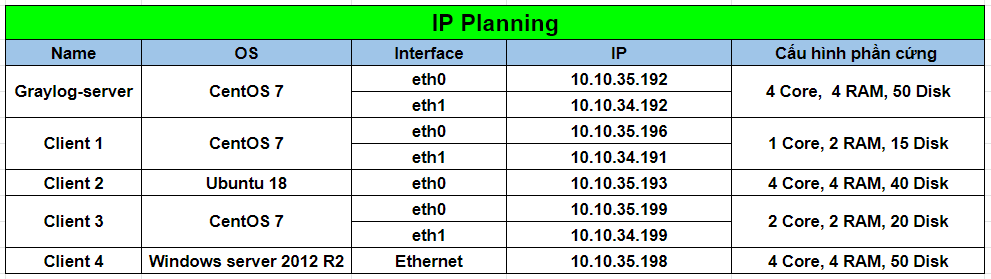

# Tài liệu tìm hiểu về Graylog 4

Tài liệu ghi chép về tìm hiểu và triển khai graylog 4 để thu thập log ssh của các hệ điều hành CentOS 7, Ubuntu 18 và Windows server 2012. 

## Mô hình triển khai 

## IP Planning

## Mục lục

|   # STT   | Topics     |
|:-----------:|:-------------------------------------------------------------------------------------------------------------|
|  01   |  [Cài đặt graylog-server trên CentOS 7](./docs/1.Install_graylog_server.md) |
|  02   |  [Cấu hình thu thập log CentOS 7 thông qua graylog-sidecar](./docs/2.Config_graylog_sidecar_in_CentOS7.md) |
|  03   |  [Cấu hình thu thập log Ubuntu 18 thông qua graylog-sidecar](./docs/3.Config_graylog_sidecar_in_ubuntu18.md) |
|  04   |  [Cấu hình thu thập log Windows thông qua graylog-sidecar](./docs/4.Congfig_graylog_sidecar_in_windows.md) |
|  05   |  [Cấu hình thu thập log của Linux thông qua syslog](./docs/5.Config_collect_log_linux_use_syslog.md) |
|  06   |  [Hướng dẫn đặt lại mật khẩu cho user admin trong graylog server](./docs/6.Reset_password_admin_in_graylog_server.md) |
|  07   |  [Hướng dẫn tạo grok patterns với log ssh](./docs/7.Config_grok_pattern_in_graylog.md) |
|  08   |  [Hướng dẫn sử dụng lookup tables trên graylog](./docs/8.Config_lookup_tables_in_graylog.md) |
|  09   |  [Hướng dẫn cấu hình dashboards với log ssh](./docs/9.Config_dashboards_with_log_ssh.md) |  
|  10   |  [Cấu hình graylog server tích hợp cảnh báo qua Slack](./docs/10.Config_graylog_server_sending_alert_to_slack.md) |
|  11   |  [Cấu hình graylog server tích hợp cảnh báo qua Telegram](./docs/11.Config_graylog_server_sending_alert_to_telegram.md) |
|  12   |  [Cấu hình graylog server tích hợp cảnh báo qua Email](./docs/12.Config_graylog_server_sending_alert_to_email.md) |
|  13   |  [Cấu hình event cảnh báo log shutdown trên windows](./docs/13.Config_event_alert_log_shutdown_windows.md) |
|  14   |  [Cấu hình event cảnh báo log RDP trên windows](./docs/14.Config_event_alert_log_RDP_windows.md) |S