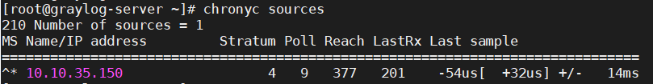
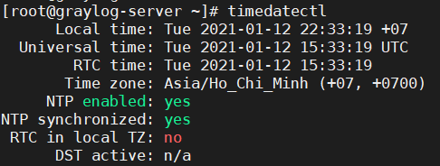

# Cài đặt graylog server

## 1. Mô hình triển khai 

### 1.1 Mô hình LAB  


### 1.2 IP planning


## 2. Cài đặt

### 2.1. Cài đặt Graylog-server 

#### 2.1.1. Thiết lập môi trường 

- Đảm bảo các ip đã được đặt tĩnh để không xảy ra thay đổi trong quá trình vận hành. Bạn có thể tham khảo cách đặt địa chỉ ip tĩnh cho centos 7 [tại đây](https://news.cloud365.vn/thiet-lap-co-ban-cho-centos7/).

- Thực hiện update và cài đặt gói bổ trợ: 

```
yum install -y epel-release
yum update -y
yum install -y git wget curl byobu
yum install -y pwgen
yum install -y httpd
```

- Khởi động dịch vụ http:

```
systemctl start httpd 
systemctl enable httpd
```

- Tắt selinux:

```
sed -i 's/SELINUX=enforcing/SELINUX=disabled/g' /etc/sysconfig/selinux
sed -i 's/SELINUX=enforcing/SELINUX=disabled/g' /etc/selinux/config
```

#### 2.1.2. Cài đặt NTP 

Cấu hình thời gian là 1 bước rất quan trọng vì để nhận log 1 cách chính xác nhất thì thời gian cũng phải chính xác. Có 2 cách cài ntp là ta có thể cấu hình thủ công ntp server hoặc đồng bộ từ máy chủ ntp (trong hoặc ngoài mạng)

Trong trường hợp này mình sẽ đồng bộ thời gian từ máy chủ ntp bên trong mạng. 

- Cấu hình ntp trên cả máy Client và Server: 

```
yum install -y chrony
```

- Để thời gian được đồng bộ, sửa file cấu hình `/etc/chrony.conf` như sau: 

```
sed -i 's/server 0.centos.pool.ntp.org iburst/server 10.10.35.150 iburst/g' /etc/chrony.conf
sed -i 's/server 1.centos.pool.ntp.org iburst/#server 1.centos.pool.ntp.org iburst/g' /etc/chrony.conf
sed -i 's/server 2.centos.pool.ntp.org iburst/#server 2.centos.pool.ntp.org iburst/g' /etc/chrony.conf
sed -i 's/server 3.centos.pool.ntp.org iburst/#server 3.centos.pool.ntp.org iburst/g' /etc/chrony.conf
```

> Lưu ý: `10.10.35.150` là địa chỉ IP của ntp server trong mạng. 

- Khởi động và kích hoạt chrony: 

```
systemctl start chronyd
systemctl enable chronyd
```

- Kiểm tra lại đồng bộ hóa thời gian:

```
chronyc sources
```



- Kiểm tra thời gian hệ thống: 

```
timedatectl
```


#### 2.1.3. Cài đặt Java

```
yum install -y java-1.8.0-openjdk-headless.x86_64
```

#### 2.1.4. Cài đặt MongoDB 

- Khai báo repo cho MongoDB:

Tạo file /etc/yum.repos.d/mongodb-org-4.0.repo và khai báo nội dung như sau: 

```
cat <<EOF> /etc/yum.repos.d/mongodb-org-4.2.repo
[mongodb-org-4.2]
name=MongoDB Repository
baseurl=https://repo.mongodb.org/yum/redhat/\$releasever/mongodb-org/4.2/x86_64/
gpgcheck=1
enabled=1
gpgkey=https://www.mongodb.org/static/pgp/server-4.2.asc
EOF
```

- Cài đặt MongoDB: 

```
yum install -y mongodb-org
```

- Khởi động MongoDB:

```
systemctl daemon-reload
systemctl enable mongod.service
systemctl start mongod.service
```

- Kiểm tra trạng thái của MongoDB: 

```
systemctl status mongod
```

#### 2.1.5. Cài đặt Elasticsearch

- Khai báo repo cho Elasticsearch: 

```
rpm --import http://packages.elastic.co/GPG-KEY-elasticsearch
```

Chạy lệnh sau để tạo file `/etc/yum.repos.d/elasticsearch.repo` và khai báo nội dung cho repo:

```
cat <<EOF > /etc/yum.repos.d/elasticsearch.repo
[elasticsearch-7.x]
name=Elasticsearch repository for 7.x packages
baseurl=https://artifacts.elastic.co/packages/7.x/yum
gpgcheck=1
gpgkey=https://artifacts.elastic.co/GPG-KEY-elasticsearch
enabled=1
autorefresh=1
type=rpm-md
EOF
```

- Cài đặt Elasticsearch 

```
yum install -y elasticsearch
```

- Backup file cấu hình elasticsearch: 

```
cp /etc/elasticsearch/elasticsearch.yml /etc/elasticsearch/elasticsearch.yml.bk
```

- Sửa file cấu hình `/etc/elasticsearch/elasticsearch.yml` của elasticsearch như sau: 

```
sed -i 's/#cluster.name: my-application/cluster.name: graylog/g' /etc/elasticsearch/elasticsearch.yml
```

- Khởi động lại elasticsearch

```
systemctl daemon-reload
systemctl enable elasticsearch.service
systemctl restart elasticsearch.service
```

- Kiểm tra trạng thái của elasticsearch 

```
systemctl status elasticsearch.service
```

#### 2.1.6. Cài đặt graylog 

- Tải về repo của graylog:

```
rpm -Uvh https://packages.graylog2.org/repo/packages/graylog-4.0-repository_latest.rpm
```

- Cài đặt graylog 4:

```
yum update && sudo yum install -y graylog-server graylog-enterprise-plugins graylog-integrations-plugins graylog-enterprise-integrations-plugins
```

- Thực hiện backup trước khi sửa file cấu hình phòng khi bị lỗi:

```
cp /etc/graylog/server/server.conf /etc/graylog/server/server.conf.bk 
```

- Tạo chuỗi hash gồm 96 ký tự để khai báo cho password_secret  sau đó lưu vào file cấu hình:

```
pass_secret=$(pwgen -N 1 -s 96)
sed -i -e 's|password_secret =|password_secret = '$pass_secret'|' /etc/graylog/server/server.conf
```

- Tạo mật khẩu đăng nhập cho tài khoản admin để đăng nhập graylog: 

```
pass_sha=$(echo -n Viethung1999@ | sha256sum | awk '{print $1}') && sed -i -e 's|root_password_sha2 =|root_password_sha2 = '$pass_sha'|' /etc/graylog/server/server.conf
```

> Trong đó: Viethung1999@ là mật khẩu sử dụng để đăng nhập vào graylog bằng user admin

- Đặt timezone cho graylog: 

```
sed -i 's|#root_timezone = UTC|root_timezone = Asia/Ho_Chi_Minh|' /etc/graylog/server/server.conf
```

- Đặt địa chỉ sử dụng để truy cập web interface bằng nhiều card mạng: 

```
sed -i 's|#http_bind_address = 127.0.0.1:9000|http_bind_address = 0.0.0.0:9000|' /etc/graylog/server/server.conf

sed -i 's|#http_enable_cors = false|http_enable_cors = true|' /etc/graylog/server/server.conf
```

- Bỏ comment để sử dụng user admin:

```
sed -i 's|#root_username = admin|root_username = admin|' /etc/graylog/server/server.conf
```

- Vì máy có nhiều card mạng nên cần phải đặt lại địa chỉ public uri để các node khác có thể kết nối tới node graylog-server thông qua các card mạng khác nhau: 

```
sed -i 's|#http_publish_uri = http://192.168.1.1:9000/|http_publish_uri = http://0.0.0.0:9000/|' /etc/graylog/server/server.conf
```

- Khởi động dịch vụ graylog-server:

```
systemctl daemon-reload
systemctl enable graylog-server.service
systemctl start graylog-server.service
```

- Kiểm tra trạng thái của graylog-server:

```
systemctl status graylog-server
```

#### 2.1.7. Login 

Login với địa chỉ https://IP:9000 bằng user: admin và password: Viethung1999@ để đăng nhập vào Web interface của dịch vụ graylog. 

