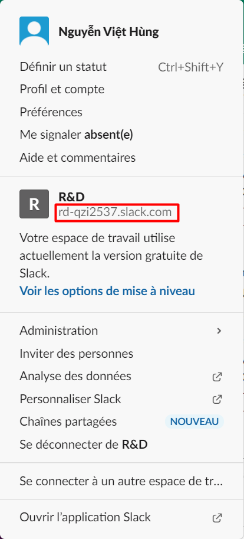
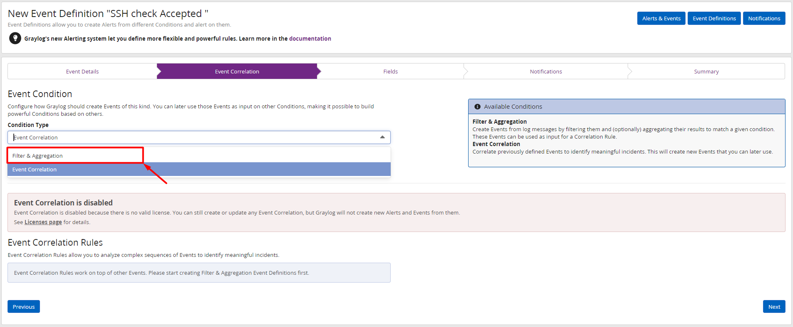
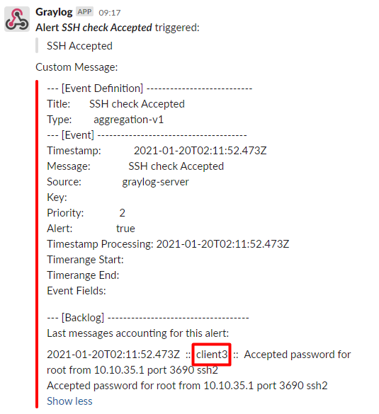

# Cấu hình graylog server tích hợp cảnh báo qua Slack

## Cấu hình cảnh báo Slack

- Di chuyển đến thư mục plugin của Graylog-server: 

```
cd /usr/share/graylog-server/plugin/
```

- Tải về plugin của slack:

```
wget https://github.com/graylog-labs/graylog-plugin-slack/releases/download/3.1.0/graylog-plugin-slack-3.1.0.jar
```

- Khởi động lại dịch vụ graylog-server : 

```
systemctl restart graylog-server
systemctl status graylog-server
```

- Trên kênh slack tạo 1 channel có tên là graylog: 


- Sau đó copy link của không gian làm việc: 



- Truy cập địa chỉ sau với `<organization>` là link vừa copy:

```
https://<organization>/apps/new/A0F7XDUAZ-webhooks-entrants
```

- Chọn channel là graylog vừa tạo và tích hợp thêm Webhooks đến:


- Sau đó ta sẽ có được URL Webhooks, copy và note lại để sau sử dụng cho việc gửi cảnh báo về channel: 


Tiếp đến, trên Web Interface của graylog-server vào `Alerts` -> `Notification` -> `Get Stated!`


Sau đó điền các thông tin như sau: 


1. Để dễ nhận biết, ta nhập vào tiêu đề cho cảnh báo. 
2. Mô tả ngắn cho cảnh báo này
3. Chọn `Notification Type` là `Slack Notification`
4. Nhập vào `Webhook URL` đã copy trước đó
5. Nhập vào tên channel đã tạo để nhận cảnh báo trên slack trước đó. 
6. Tích chọn `Link Names`
7. Kích vào `Execute Test Notification` để gửi thử 1 cảnh báo. Khi trạng thái trả về là `Success` tức là cấu hình đã đúng.
8. Chọn `Create` để tạo cảnh báo về slack. 

- Truy cập vào channel `graylog` trên slack để kiểm tra message test:


Ta thấy đã có message!

## Cấu hình gửi cảnh báo

### Cấu hình event cảnh báo

- Chuyển sang tab `Event Definitions` và chọn `Get Stated!` để cấu hình event cảnh báo. 


- Nhập vào tiêu đề và mô tả ngắn cho sự kiện:


- Chọn `Condition Type` là `Filter & Aggregation`: 



- Tiếp theo nhập vào các thông tin như sau: 


1. Ở mục `Search Query`, vì mình muốn tạo cảnh báo khi có ssh thành công vào hệ thống nên ta nhập vào là `ACTION: Accepted`.
2. Tại `Streams`, ta chọn là `All messages`
3. Chọn `Next` để tiếp tục

>Lưu ý: `Search within the last` và `Execute search every` là tìm trong vòng 1 phút cuối cùng và thời gian cách mỗi lần tìm kiếm là 1 phút. 

- Tiếp đến là `Event Fields`, là 1 trường bổ sung thông tin về cảnh báo và thêm ngữ cảnh khi cảnh báo nhưng là 1 trường không bắt buộc nên ta có thể bỏ qua:


- Mục tiếp theo là mục `Notification` , click chọn `Add Notification` và chọn cảnh báo về Slack đã tạo trước đó:


- Ta chọn notification là `Slack Alert`:


- Sau đó chọn `Done` để xác nhận:


- Tại bước này cung cấp 1 bản tóm tắt về định nghĩa cảnh báo vừa tạo. Chọn `Done` để hoàn tất cài đặt Alert: 


### Kiểm tra cấu hình cảnh báo 

- Tiến hành ssh vào các máy client để kiểm tra xem có cảnh báo gửi về hay không. 

- Sau đó ta kiểm tra trên slack đã thấy có cảnh báo ssh alert gửi về từ các client: 





