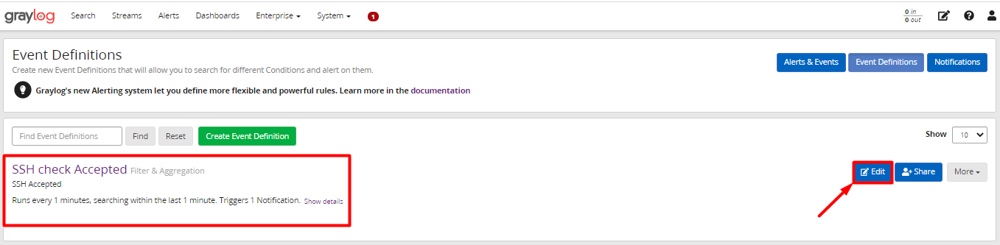
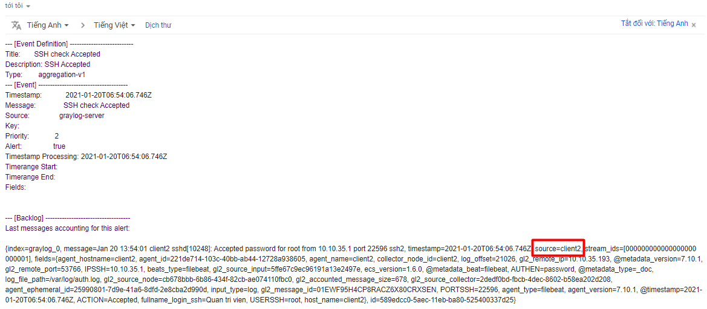

# Cấu hình graylog server tích hợp cảnh báo qua Email

## Cấu hình cảnh báo Email

### Cấu hình postfix

Để cài đặt cảnh báo để gửi về email thì trước tiên ta phải cài đặt dich vụ mail để có thể gửi cảnh báo. 

- Cài đặt và cấu hình postfix trên graylog-server

Các bước cài đặt và cấu hình postfix trên graylog-server có thể tham khảo [tại đây!](https://news.cloud365.vn/huong-dan-gui-mail-dung-postfix/)

- Sau khi cài đặt postfix thành công, thêm phần cấu hình sau vào cuối file `/etc/graylog/server/server.conf`:

```
transport_email_enabled = true
transport_email_hostname = smtp.gmail.com
transport_email_port = 587
transport_email_use_auth = true
transport_email_auth_username = your_mail@gmail.com
transport_email_auth_password = your_password
transport_email_subject_prefix = [graylog]
transport_email_from_email = your_mail@gmail.com
transport_email_use_tls = true
transport_email_use_ssl = false
```

> **Lưu ý:** Ta cần sửa email và mật khẩu ở mục `transport_email_auth_username`, `transport_email_from_email` và `transport_email_auth_password` cho giống với email và password trong file sasl. Mục `transport_email_auth_username` và `transport_email_from_email` nhập giống nhau.

- Lưu lại thay đổi và khởi động lại dịch vụ graylog-server: 

```
systemctl restart graylog-server
```

### Cấu hình Cảnh báo Email

- Trên Web Interface của graylog-server vào `Alerts` -> `Notification` -> `Create Notification`:


- Điền thông tin vào các trường như bên dưới: 


1. Đặt tiêu đề cho cảnh báo
2. Mô tả ngắn về cảnh báo này
3. Chọn `Notification Type` là `Email Notification`
4. Nhập vào email của người gửi, tức là email đã được định cấu hình trong file config của graylog-server
5. Chọn user là `admin`
6. Nhập vào email của người nhận, khi có đăng nhập thành công thì cảnh báo sẽ được gửi về email này. 
7. Kích vào `Exxcute Test Notification` để gửi thử 1 mail test, nếu trạng thái trả về `Success` tức là cấu hình đã thành công. 
8. Chọn `Create` để tạo cảnh báo email

- Truy cập email kiểm tra ta thấy có 1 email test được gửi đến: 


## Cấu hình gửi cảnh báo

### Cấu hình event cảnh báo

- Chuyển sang tab `Event Definitions` để cấu hình event cảnh báo. ở bài trước mình đã cấu hình `Event` và add cảnh báo cho slack rồi nên bài này mình không cấu hình lại `Event` nữa. Mà mình chỉ tiến hành add thêm cảnh báo cho Event thôi. Bạn có thể xem lại cách cấu hình event cảnh báo [tại đây!](https://github.com/hungviet99/ghichep-Graylog/blob/master/docs/10.Config_graylog_server_sending_alert_to_slack.md)

- Chọn `Edit` để chỉnh sửa Event: 



- Chuyển tới tab `Notifications` để thêm cảnh báo cho Email và chọn `Add Notification` để thêm cấu hình cảnh báo: 


- Sau đó chọn `Notification` là `Email Notification`  và chọn `Done` để add: 


- Chọn `Next` để tiếp tục: 


- Chọn `Done` để hoàn tất cài đặt alert: 


### Kiểm tra cấu hình cảnh báo 

- Tiến hành ssh vào các máy client để kiểm tra xem có cảnh báo gửi về hay không. 

- Sau đó ta kiểm tra trên slack đã thấy có cảnh báo ssh alert gửi về từ các client: 





