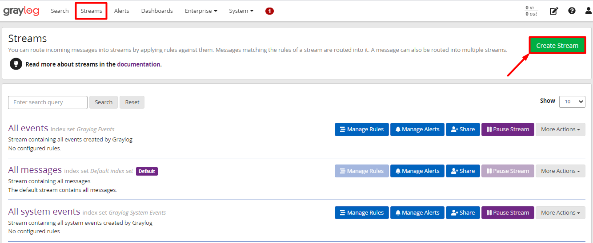
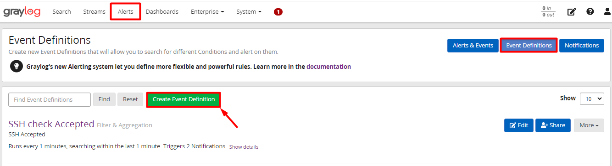

# Cấu hình event cảnh báo log shutdown trên windows

ở phần trước ta đã tiến hành cấu hình thu thập log Windows thông qua graylog-sidecar. Ở bài này mình sẽ tạo 1 event để cảnh báo về email khi hệ thống tiến hành reboot hoặc shutdown.

Được biết rằng, các kiểu shutdown hoặc restart trên windows được thể hiện bằng `event_id` của nó.

- `event_id` = `1074`: Hệ thống khởi động lại do 1 ứng dụng (vd: windows update) hoặc khi người dùng bắt đầu khởi động lại, tắt máy

- `event_id` = `6008`: Hệ thống đã bất ngờ tắt máy mà không có kế hoạch trước

- `event_id` = `6006`: Hệ thống tắt máy theo kế hoạch

- `event_id` = `41`: Sự kiện xảy ra nếu hệ thống ngừng phản hồi hoặc gặp sự cố mất nguồn đột ngột. 

Đầu tiên trước khi tạo event, mình sẽ cấu hình stream để lọc lấy log `system` trên windows.

## Tạo streams cho log system

Trên web interface của graylog server, ta vào tab `Streams` và chọn `Create Stream`: 

Sau đó điền tên và mô tả cho `Stream` này: 

Tiếp theo, kích vào `Manage Rules` để đặt rule cho stream này: 

- Ta sẽ add các rule cho stream này, chọn `Add stream rule` để add cho các rule: 

- Điền các thông số như sau: 

Ở trường `Field` ta nhập là `beats_type` để hiển thị type của beat, ở `Value` ta nhập `Winlogbeat`. Tức là giá trị ở trường `beat_type` phải là `winlogbeat`. 

- Tương tự như trên, ta add thêm 1 stream rule nữa như sau: 

Ở trường `Field` ta nhập là `log_name` để lấy nguồn log, ở `Value` ta nhập `System` để lấy log hệ thống. Tức là để lấy log `system`, giá trị ở trường `log_name` phải là `System`.

- Khi sau khi add rule, chọn `I'm done!` để kết thúc: 

- Sau đó chọn `Start Stream` để bắt đầu: 

## Tạo event cảnh báo 

Ở tab `Alers`, chọn mục `Event Definitions` sau đó chọn `Create Event Definition` để tạo event cảnh báo.

- Nhập vào tiêu đề và mô tả ngắn cho event: 

- Chọn `Condition Type` là `Filter & Aggregation`:

- Tiếp theo nhập vào các thông tin như sau:

1. Ở mục `Search Query`, ta nhập truy vấn để bắt các event shutdown hoặc restart `event_id: 1074 AND event_id: 6006 AND event_id: 6008 AND event_id: 41`

2. Chọn `Streams` để mới tạo ở trên. 

3. Chọn `Next` để tiếp tục. 

- Tiếp đến là `Event Fields`, là 1 trường bổ sung thông tin về cảnh báo và thêm ngữ cảnh khi cảnh báo nhưng là 1 trường không bắt buộc nên ta có thể bỏ qua:

- Mục tiếp theo là mục `Notification` , click chọn `Add Notification`: 

- Vì ở phần trước mình đã tạo cảnh báo cho email nên tại đây mình chỉ việc add cảnh báo là `Email Notification` và chọn `Done` để xác nhận:

- Chọn `Next` để tiếp tục: 

- Tại bước này cung cấp 1 bản tóm tắt về định nghĩa cảnh báo vừa tạo. Chọn `Done` để hoàn tất cài đặt Alert:

## Kiểm tra cấu hình cảnh báo

Khởi động lại hoặc tắt máy windows để kiểm tra cảnh báo có gửi về email hay không. 

- Sau đó ta kiểm tra trên email đã thấy có cảnh báo restart máy: 

