# Cấu hình event cảnh báo log remote desktop trên windows

Các log RDP được lưu trong log `security` và các log RDP sẽ có `event_id` là `4624`. Vậy nên, trước khi tạo event, mình sẽ cấu hình stream để lọc lấy log `security` trên windows.

## Tạo stream cho log security

Trên web interface của graylog server, ta vào tab `Streams` và chọn `Create Stream`: 

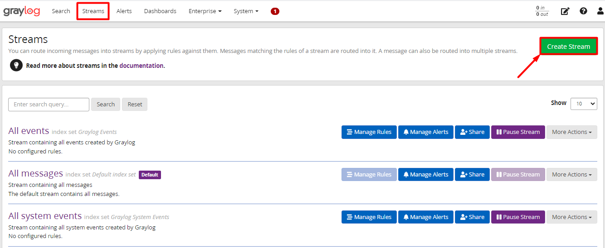

Sau đó điền tên và mô tả cho `Stream` này: 

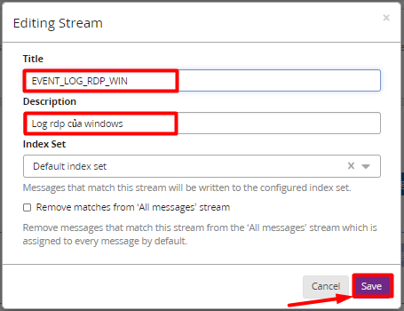

Tiếp theo, kích vào `Manage Rules` để đặt rule cho stream này: 

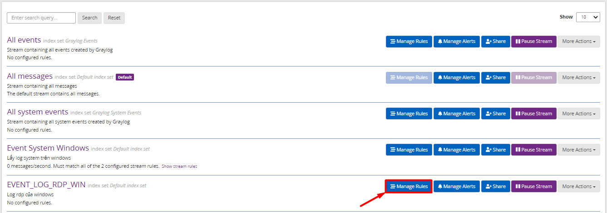

- Ta sẽ add các rule cho stream này, chọn `Add stream rule` để add cho các rule: 

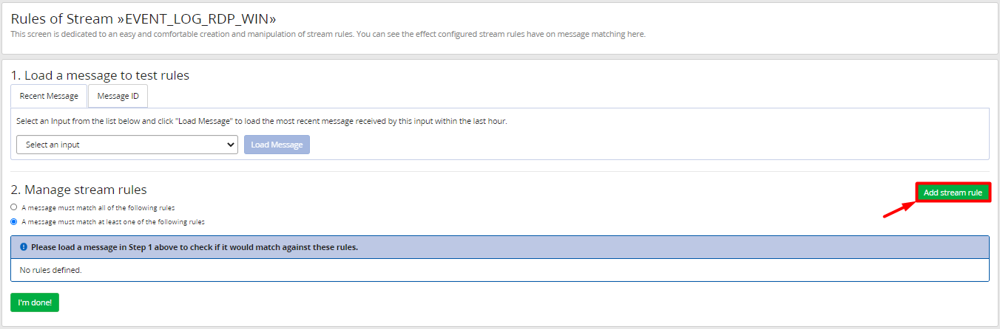

- Điền các thông số như sau: 

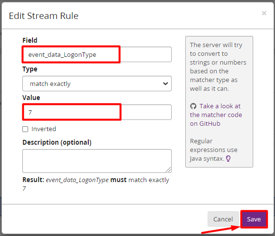

Ở trường `Field` ta nhập là `event_data_LogonType`, ở `Value` ta nhập `7`. Tức là giá trị ở trường `event_data_LogonType` phải là `7`. Vì đó là log mà người dùng kết nối lại vào 1 session đã tồn tại. 

- Tương tự như trên, ta add thêm 1 stream rule nữa như sau: 

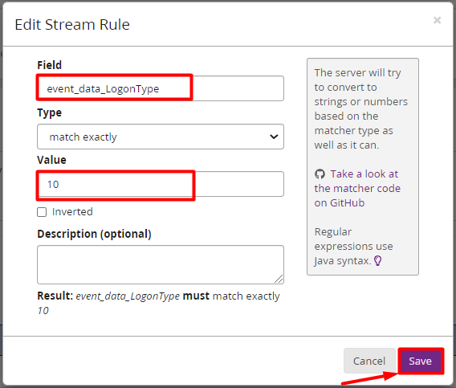

Ở trường `Field` ta nhập là `event_data_LogonType`, ở `Value` ta nhập `10`. Vì đó là log mà người dùng kết nối rdp và 1 session mới được tạo. 

- Khi sau khi add rule, chọn `I'm done!` để kết thúc: 

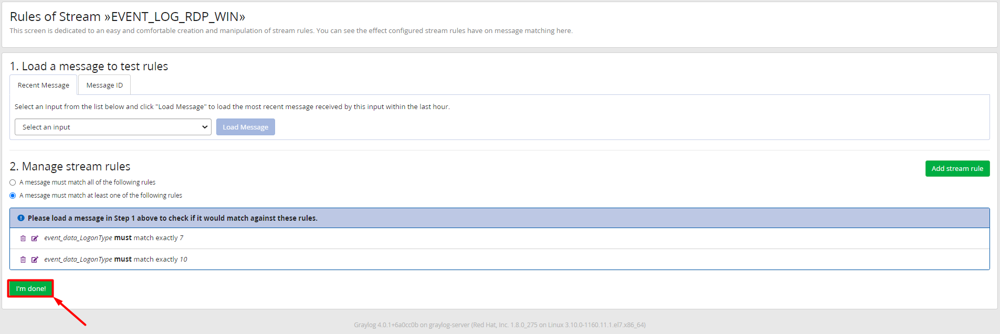

- Sau đó chọn `Start Stream` để bắt đầu: 

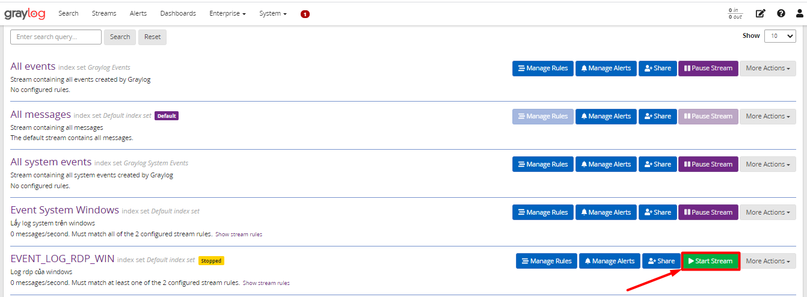

## Tạo event cảnh báo 

Ở tab `Alers`, chọn mục `Event Definitions` sau đó chọn `Create Event Definition` để tạo event cảnh báo.

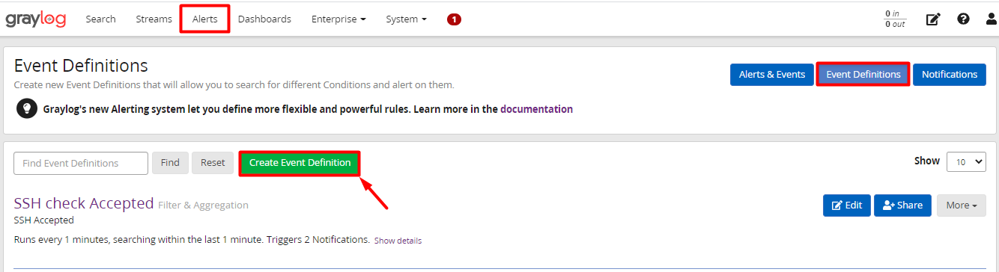

- Nhập vào tiêu đề và mô tả ngắn cho event: 

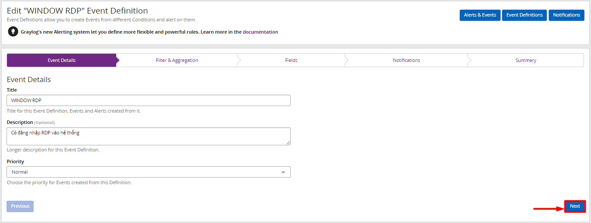

- Ở phần filter ta sẽ nhập như sau: 

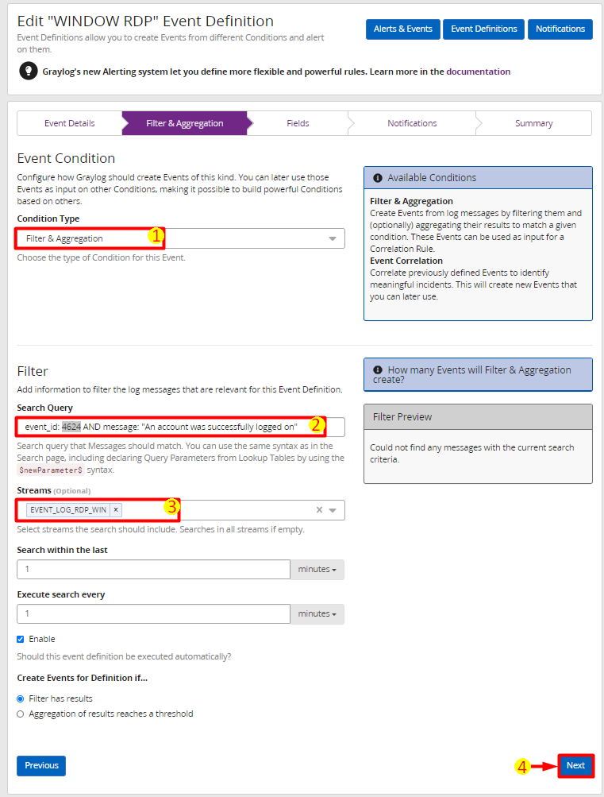

1. Chọn `Condition Type` là `Filter & Aggregation`
 
2. Ở mục `Search Query`, ta nhập truy vấn để bắt các event shutdown hoặc restart `event_id: 4624 AND message: "An account was successfully logged on"`

3. Chọn `Streams` mới tạo ở trên. 

4. Chọn `Next` để tiếp tục. 

- Tiếp đến là `Event Fields`, là 1 trường bổ sung thông tin về cảnh báo và thêm ngữ cảnh khi cảnh báo nhưng là 1 trường không bắt buộc nên ta có thể bỏ qua:

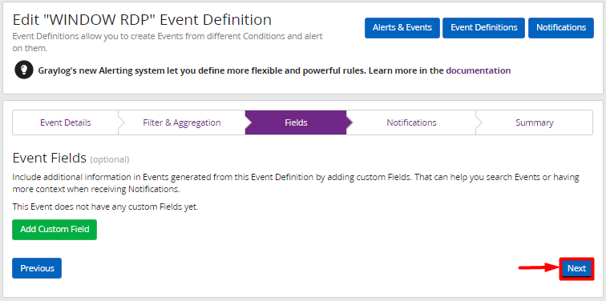

- Mục tiếp theo là mục `Notification` , click chọn `Add Notification`: 

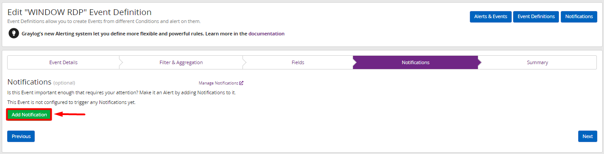

- Vì ở phần trước mình đã tạo cảnh báo cho email nên tại đây mình chỉ việc add cảnh báo là `Email Notification` và chọn `Done` để xác nhận:

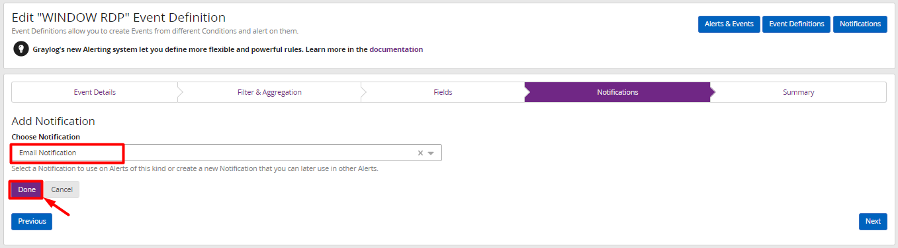

- Chọn `Next` để tiếp tục: 

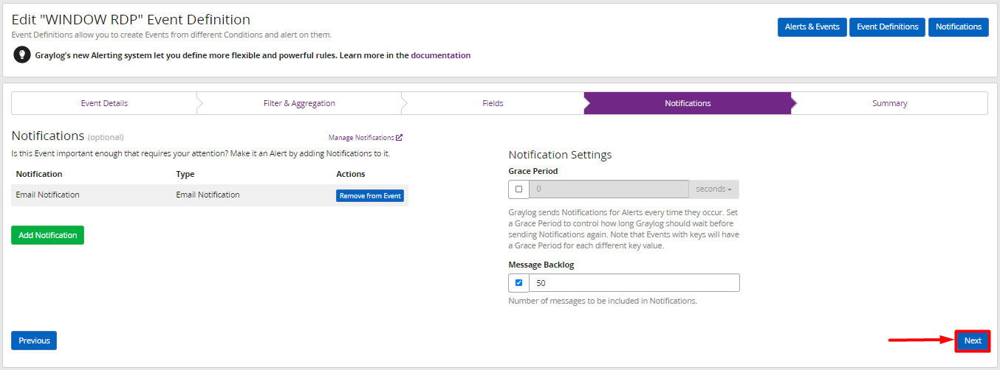

- Tại bước này cung cấp 1 bản tóm tắt về định nghĩa cảnh báo vừa tạo. Chọn `Done` để hoàn tất cài đặt Alert:

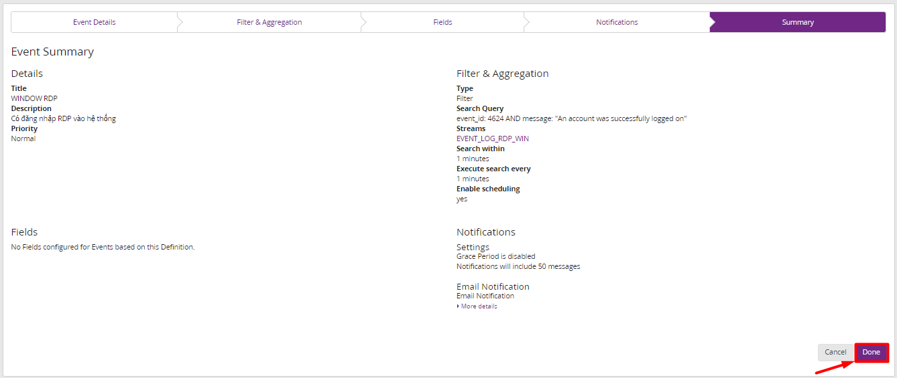

## Kiểm tra cấu hình cảnh báo

Tiến hành remote desktop vào máy windows để kiểm tra cảnh báo có gửi về email hay không. 

- Sau đó ta kiểm tra trên email đã thấy có cảnh báo RDP:

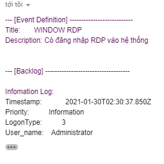