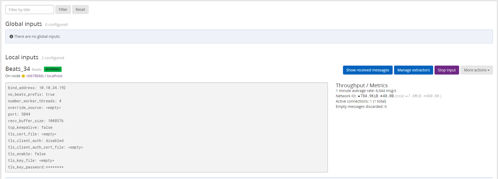
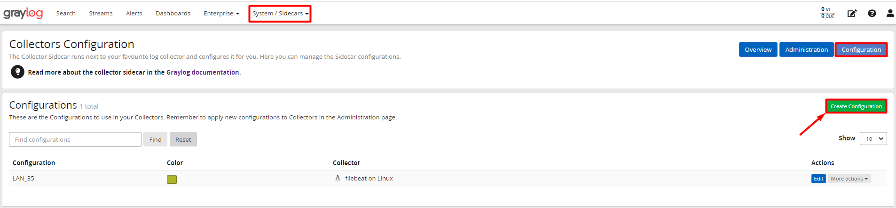

# Cấu hình thu thập log CentOS 7 thông qua graylog-sidecar

## 1. Mô hình triển khai 

### 1.1 Mô hình LAB  


### 1.2 IP planning


## 2. Cài đặt và cấu hình

### 2.1. Thao tác trên `client 1`

### 2.1.1 Thiết lập môi trường 

- Thực hiện update và cài đặt gói bổ trợ: 

```
yum install -y epel-release
yum update -y
yum install -y git wget curl byobu
yum install -y pwgen
```

- Tắt selinux:

```
sed -i 's/SELINUX=enforcing/SELINUX=disabled/g' /etc/sysconfig/selinux
sed -i 's/SELINUX=enforcing/SELINUX=disabled/g' /etc/selinux/config
```

### 2.1.2. Cài đặt NTP 

- Cấu hình ntp trên cả máy Client và Server: 

```
yum install -y chrony
```

- Để thời gian được đồng bộ, sửa file cấu hình `/etc/chrony.conf` như sau: 

```
server 10.10.35.150 iburst
#server 1.centos.pool.ntp.org iburst
#server 2.centos.pool.ntp.org iburst
#server 3.centos.pool.ntp.org iburst
```

> Lưu ý: `10.10.35.150` là địa chỉ IP của ntp server trong mạng. 

- Khởi động và kích hoạt chrony: 

```
systemctl start chronyd
systemctl enable chronyd
```

- Kiểm tra lại đồng bộ hóa thời gian:

```
chronyc sources
```

- Kiểm tra thời gian hệ thống: 

```
timedatectl
```

### 2.1.3. Cài đặt Filebeat và Sidecar

**Cài đặt file Beats**

```
wget https://artifacts.elastic.co/downloads/beats/filebeat/filebeat-7.10.1-x86_64.rpm

rpm -i filebeat-7.10.1-x86_64.rpm
```

**Cài đặt graylog-sidecar**

- Tải về kho lưu trữ và cài đặt graylog-sidecar:

```
rpm -Uvh https://packages.graylog2.org/repo/packages/graylog-sidecar-repository-1-2.noarch.rpm

yum update && sudo yum install graylog-sidecar
```

> Lưu ý:   Để cấu hình sidecar, trước tiên ta cần đăng nhập vào Web Interface của graylog để tạo và lấy Token. Một mã token có thể dùng chung cho nhiều client cùng sử dụng sidecar.

- Sau đây là các bước để tạo và copy mã token:

**Bước 1:** Vào `Web Interface` của graylog, truy cập tab `System/Sidecars` , sau đó chọn `Create or reuse a token for the graylog-sidecar` user.


**Bước 2:** Nhập tên và chọn `Create Token` để tạo token, nên tạo tên token theo nhóm để gợi nhớ và sử dụng chung.


**Bước 3:** Sau đó ta copy mã token để sử dụng cho việc cấu hình graylog-sidecar.


Mã token có dạng như sau:

`157vjbs3t175upg3id65gb6k2nhj0v8k2k17j51g057ed8h9rl4`

> Lưu ý:  Nếu muốn lấy mã token đã tạo trước đó, ta có thể thực hiện các bước như tạo token, sau đó tìm mã token sẵn có và copy. 

Quay lại máy Graylog-sidecar (client 1) để chỉnh sửa file config, các thao tác sửa đổi được thực hiện ở file `/etc/graylog/sidecar/sidecar.yml`.

- Thực hiện backup file phòng khi cấu hình bị lỗi:

```
cp /etc/graylog/sidecar/sidecar.yml /etc/graylog/sidecar/sidecar.yml.bk
```

- Khai báo ip của graylog-server:

```
sed -i 's|#server_url: "http://127.0.0.1:9000/api/"|server_url: "http://10.10.34.192:9000/api/"|' /etc/graylog/sidecar/sidecar.yml 
```

> Lưu ý: Địa chỉ ip `10.10.34.192` được sử dụng trong trường hợp các client cùng trong `VLAN 34` Các client thuộc vlan khác cần thay địa chỉ sao cho đúng. 

- Thay giá trị `api_token` bằng chuỗi token đã tạo và copy trước đó: 

```
sed -i 's|server_api_token: ""|server_api_token: "157vjbs3t175upg3id65gb6k2nhj0v8k2k17j51g057ed8h9rl4"|' /etc/graylog/sidecar/sidecar.yml
```

- Sửa đổi và bỏ comment 1 số dòng để graylog-sidecar hoạt động: 

```
sed -i 's|#log_path: "/var/log/graylog-sidecar"|log_path: "/var/log/graylog-sidecar"|' /etc/graylog/sidecar/sidecar.yml
```

```
sed -i 's|#tls_skip_verify: false|tls_skip_verify: true|' /etc/graylog/sidecar/sidecar.yml
```

- Bỏ comment và sửa node_name như sau (sửa node_name theo tên của client): 

```
sed -i 's|#node_name: ""|node_name: "client1"|' /etc/graylog/sidecar/sidecar.yml
```

- Tiến hành khởi động dịch vụ graylog-sidecar: 

```
graylog-sidecar -service install
systemctl start graylog-sidecar
systemctl enable graylog-sidecar
```

- Kiểm tra lại trạng thái graylog-sidecar:

```
systemctl status graylog-sidecar
```

Nếu không thể khởi động dịch vụ graylog-sidecar, ta cần xem lại sửa đổi trong file config của graylog-sidecar xem sửa đổi đã giống bên dưới chưa cat `/etc/graylog/sidecar/sidecar.yml | egrep -v "^*#|^$"`. Nếu chưa giống thì sửa lại cho giống với hình dưới sau đó tiến hành khởi động lại dịch vụ graylog. 


### 2.2. Cấu hình Sidecar trên Web Interface của `graylog-server` 

### 2.2.1. Khai báo input cho Sidecar

- Để graylog-server biết nơi cần nhận log, ta cần khai báo input cho graylog-server. Truy cập `System/Inputs` và chọn input là `Beats` và bấm `Launch new input`: 


- Tiếp đến ta edit input như sau: 


- Sau khi tạo, ta có được input của file beats như sau: 



### 2.2.2. Cấu hình Sidecars

- Truy cập vào `System/Sidecar`:


- Chọn `Config sidecar` để cấu hình cho đầu vào log. Sau đó chọn tab `Configuration` sau đó chọn `Create Configuration`:



Khai báo các thông số và sửa địa chỉ ip thành địa chỉ của graylog-server. Ở đây ta chỉ lấy log ssh nên ta xóa hết những nguồn log khác, chỉ để lại `/var/log/secure` và `/var/log/auth.log` sau đó bổ sung trường `fields.source: ${sidecar.nodeName}`


- Tiếp theo, chọn tab `Administration`, tích chọn `filebeat`. Sau đó chọn configuration vừa tạo là LAN_34:


- Tiếp đến chọn `Process` `->` `Start` để khởi động trình thu thập log từ client1, có một cửa sổ bật lên, chọn `Confirm` để tiếp tục:


### 2.2.3. Kiểm tra kết quả

- Chuyển sang tab `Overview` và chọn `Show messages`:


- Sau đó ssh vào máy client1 và kiểm tra log gửi về graylog-server: 


Có log đẩy về như hình trên là đã cài thành công !!
