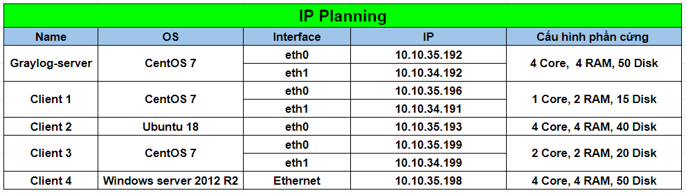

# Cấu hình thu thập log Windows thông qua graylog-sidecar

## 1. Mô hình triển khai 

### 1.1 Mô hình LAB  


### 1.2 IP planning



## 2. Cài đặt và cấu hình

### 2.1 Cài đặt graylog sidecar trên windows server 2012

Ở [bài viết trước](./3.Config_graylog_sidecar_in_ubuntu18.md) mình đã hướng dẫn tạo token trên graylog-server, bây giờ ta chỉ việc copy mã token đã tạo trước đó để phục vụ cho việc cấu hình hiện tại. 
<ul>

<br><li>Để tải graylog-sidecar, truy cập [vào đây](https://github.com/Graylog2/collector-sidecar/releases) để down file cài đặt có phần mở rộng là `exe`:</li>


<br><li>Khi tải về, tiến hành cài đặt file. Bấm `Next` để tiếp tục:</li>


<br><li>Chọn `I Agree` để đồng ý với chính sách:</li>


<li>Tiếp theo khai báo 1 số thông số cấu hình cho graylog-sidecar:</li>
<br>


<ul>
<li>Ở ô đầu tiên ta khai báo địa chỉ api của graylog-server</li>
<li>Tiếp theo ta khai báo hostname cho graylog server</li>
<li>Ở tại ô cuối cùng, ta điền giá trị api token của graylog-server đã tạo trước đó</li>

</ul>

<br><li>Sau khi cài đặt xong, bấm `Finish` để kết thúc quá trình cài đặt:</li>


<li>Mở CMD và thực hiện các lệnh để khởi động graylog sidecar</li>
<br>

```
"C:\Program Files\graylog\sidecar\graylog-sidecar.exe" -service install
"C:\Program Files\graylog\sidecar\graylog-sidecar.exe" -service start
```
</ul>

### 2.2 Cấu hình trên graylog server để nhận log từ windows

### 2.2.1. Cấu hình sidecars

Phần khai báo cho input ta không cần lặp lại nếu như đã cấu hình ở phần trước vì ta đã cấu hình input cho 2 VLAN 34 và 35, máy windows thuộc VLAN 35 nên không cần cấu hình input mới.

<ul>

<br><li>Truy cập vào `System/Sidecar`, chọn `Manager sidecar`:</li>


<br><li>Sau đó chọn tab `Configuration` và chọn `Create Configuration`:</li>


<br><li>Khai báo các thông số và sửa địa chỉ ip thành địa chỉ của graylog-server, sau đó bổ sung trường `fields.source: ${sidecar.nodeName}` để hiển thị nodeName của log:</li>


<br><li>Tiếp theo, chọn tab `Administration`, tích chọn `winlogbeat`. Sau đó chọn configuration vừa tạo là `WIN_LOG`:</li>


<br><li>Tiếp đến chọn `Process` `->` `Start` để khởi động trình thu thập log từ `winsrv2012`, có một cửa sổ bật lên, chọn `Confirm` để tiếp tục:</li>


</ul>

### 2.2.2. Kiểm tra kết quả

<ul>

<br><li>Chuyển sang tab `Overview` và chọn `Show messages`:</li>


<br><li>Sau đó đăng nhập vào 1 tài khoản trên windows và kiểm tra log gửi về graylog-server:</li>


Có log đẩy về như hình trên là đã cài thành công !!


