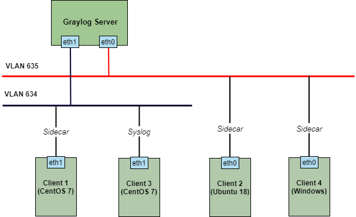

# Cấu hình thu thập log của linux thông qua syslog

## 1. Mô hình triển khai 

### 1.1 Mô hình LAB  



### 1.2 IP planning


## 2. Cài đặt và cấu hình

### 2.1. Thao tác trên máy `client 3`

### 2.1.1 Thiết lập môi trường 

- Thực hiện update và cài đặt gói bổ trợ: 

```
yum install -y epel-release
yum update -y
yum install -y git wget curl byobu
yum install -y pwgen
```

- Tắt selinux:

```
sed -i 's/SELINUX=enforcing/SELINUX=disabled/g' /etc/sysconfig/selinux
sed -i 's/SELINUX=enforcing/SELINUX=disabled/g' /etc/selinux/config
```

### 2.1.2. Cài đặt NTP 

- Cấu hình ntp trên cả máy Client và Server: 

```
yum install -y chrony
```

- Để thời gian được đồng bộ, sửa file cấu hình `/etc/chrony.conf` như sau: 

```
server 10.10.35.150 iburst
#server 1.centos.pool.ntp.org iburst
#server 2.centos.pool.ntp.org iburst
#server 3.centos.pool.ntp.org iburst
```

> Lưu ý: `10.10.35.150` là địa chỉ IP của ntp server trong mạng. 

- Khởi động và kích hoạt chrony: 

```
systemctl start chronyd
systemctl enable chronyd
```

- Kiểm tra lại đồng bộ hóa thời gian:

```
chronyc sources
```

- Kiểm tra thời gian hệ thống: 

```
timedatectl
```

### 2.1.3. Cấu hình rsyslog

- Tiến hành cấu hình IP và port để gửi log về graylog server:

```
echo '*.*  @10.10.34.192:14514;RSYSLOG_SyslogProtocol23Format' >> /etc/rsyslog.conf
```

> Lưu ý: thay địa chỉ `10.10.34.192` bằng địa chỉ graylog server của bạn và có thể thay thế port `14514` bằng port bạn muốn sử dụng. 

- Khởi động lại dịch vụ rsyslog

```
systemctl restart rsyslog
```

### 2.2. Cấu hình syslog trên Web Interface của `graylog-server` 

### 2.2.1. Khai báo input cho syslog

- Để graylog-server biết nơi cần nhận log, ta cần khai báo input cho graylog-server. Truy cập `System/Inputs` và chọn input là `Syslog UDP` và bấm `Launch new input`: 


- Tiếp đến ta đặt tên cho input, cấu hình ip của interface nhận log và port. (port phải trùng với port khai báo ở client)


- Sau khi tạo, ta có được input của file syslog như sau: 


### 2.2.2. Kiểm tra kết quả

- Tại input của syslog, ta chọn `Show received messages`:


- Sau đó ssh vào máy client3 và kiểm tra log gửi về graylog-server: 


Có log đẩy về như hình trên là đã cài thành công !!