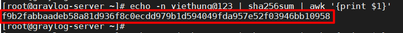
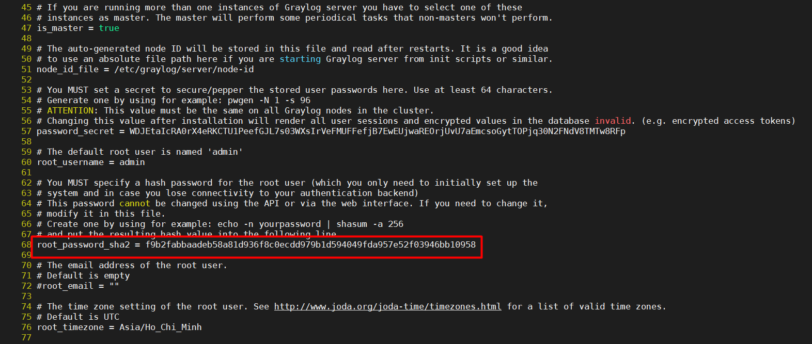

# Hướng dẫn đặt lại mật khẩu cho user admin trong Graylog-server

Đôi khi vì một lý do nào đó bạn quên mật khẩu của user khi đăng nhập hoặc đơn giản bạn muốn reset mật khẩu tránh những rủi ro đáng tiếc khi bị lộ thông tin mật khẩu ra bên ngoài. Nên bài này sẽ hướng dẫn cách đặt lại mật khẩu admin trong graylog-server. 

Ta ssh vào graylog-server với tài khoản root. 

- Sử dụng sha256 để băm mật khẩu: 

```
echo -n viethung@123 | sha256sum | awk '{print $1}'
```
>Lưu ý: `viethung@123` là mật khẩu admin mới được sử dụng để thay thế mật khẩu cũ. 



- Sau khi có được chuỗi hash của mật khẩu, ta sử dụng trình soạn thảo văn bản để truy cập vào file `/etc/graylog/server/server.conf` và tìm đến dòng chưa cụm từ `root_password_sha2`. Tiến hành thay thế chuỗi hash mật khẩu cũ bằng chuỗi hash mật khẩu mới tạo:



Lưu lại file và thoát. 

- Sau khi thêm chuỗi hash mới vào file cấu hình graylog-server. Tiến hành khởi động lại dịch vụ graylog-server:

```
systemctl restart graylog-server
```

Truy cập vào web interface của graylog-server để kiểm tra !!