# Hướng dẫn sử dụng grok patterns để extract dữ liệu với log ssh

Ở các phần trước, ta đã dựng lab cho các máy trong mạng gửi log về graylog để quản lý tập trung. Ở bài này, ta sẽ sử dụng, `grok patterns` để extract dữ liệu các message gửi về graylog-server. 

Graylog hỗ trợ trích xuất dữ liệu bằng cách sử dụng ngôn ngữ `Grok` cho phép bạn sử dụng các `patterns` có sẵn.

## 1. Extract log chứa thông tin đăng nhập ssh

- Dưới đây là message chứa thông tin đăng nhập thành công:

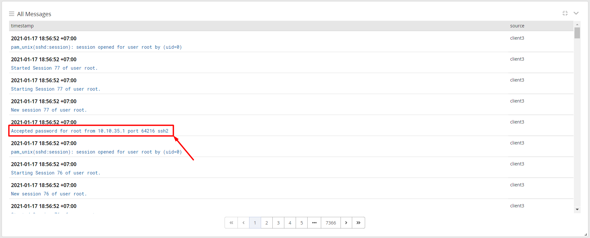

- Kích vào message chứa thông tin đăng nhập thành công. Ở trường `message` kích chọn nội dung của nó sẽ hiện lên các option của message. Chọn `Create extractor` sẽ hiển thị lên 1 tùy chọn, hãy chọn `Grok pattern` và kích `Submit`.

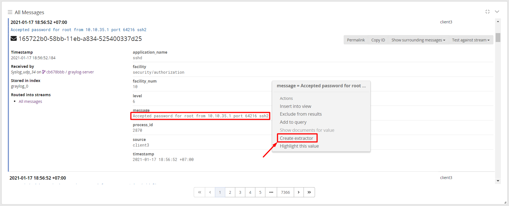

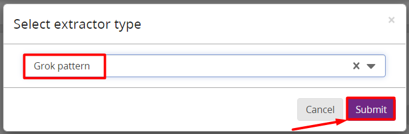

- Ta sẽ được chuyển đến giao diện như sau: 

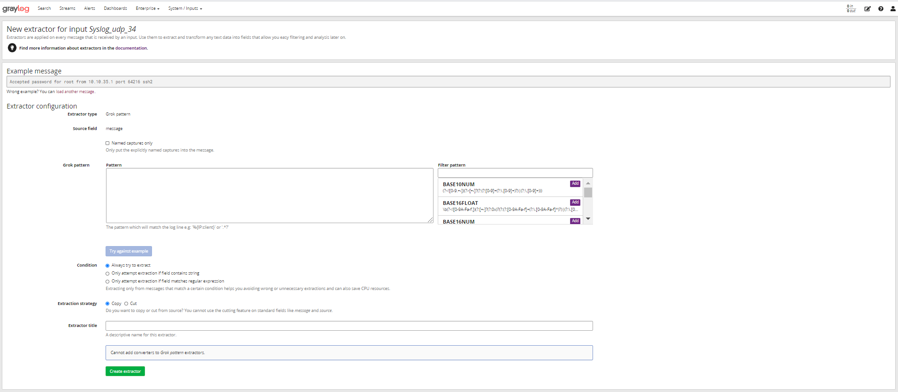

- Trong đó:

    - `New extractor for input Syslog_udp_34` chỉ ra rằng message này đẩy qua input có tên là là `New extractor for input Syslog_udp_34`, cũng là chỉ ra nơi quản lý Extractor này.  

    - Phần `Filter pattern` để tìm kiếm và `Add` các `pattern` có sẵn. 

    - Phần Pattern để nhập vào các kiểu dữ liệu để extract ra các cột riêng. Đối với bản tin log này, ta sẽ thực hiện Extract ra thành các cột `Hostname`, `Acction`, `User`, `IP` và `Port`.

- Tích chọn `Named captures only` để không hiển thị các trường không được định nghĩa

- Đối với bản tin này, đầu tiên ta sẽ extract ra trường `Accepted`: 

Sử dụng trường `Filter pattern` để search và chọn 1 `pattern` phù hợp với dữ liệu của bản tin log. Sau đó chọn add để thêm vào `Patterns`. Sử dụng : để đặt tên cho kiểu dữ liệu extract ra.

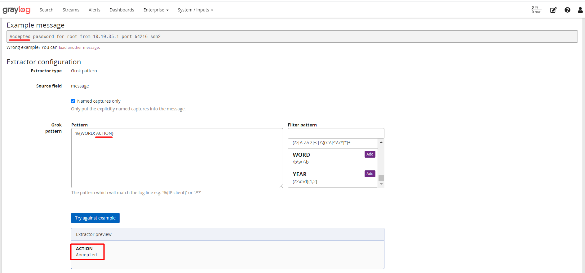

Ở đây `pattern` mình sử dụng để extract trường `Accepted` là`WORD` và mình đặt tên cho dữ liệu khi extract ra là `ACTION`. Sau đó kích vào `Try against example` ta thấy rằng dữ liệu đã được extract đúng trường `Accepted` và được đặt tên là `ACTION`. 

- Tiếp theo ta sẽ extract trường `password`, tương tự ta cũng sử dụng pattern là `WORD` và đặt tên là `Authen`. 

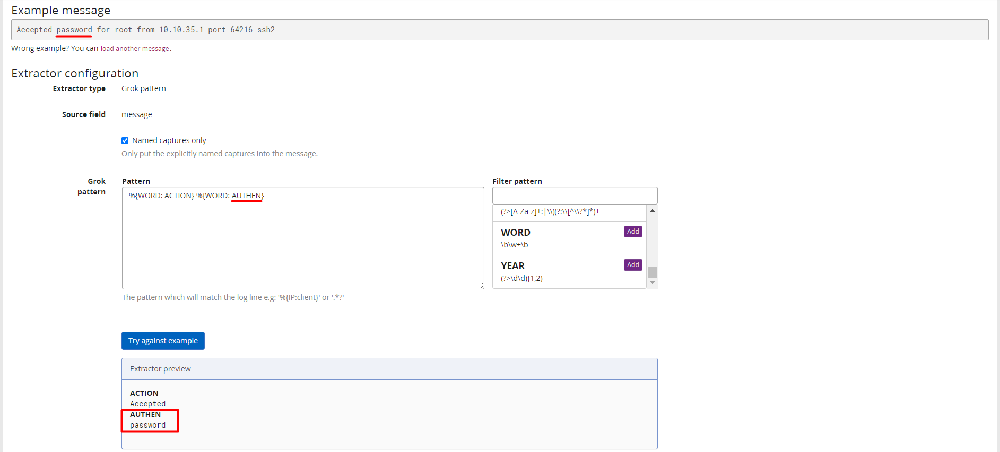

Tương tự như vậy, ta sẽ sử dụng các kiểu `pattern` có sẵn để extract tiếp các trường còn lại của message log. Với mỗi trường dữ liệu sẽ sử dụng các kiểu `pattern` tương ứng. Ví dụ: với trường ip ta sẽ sử dụng `pattern` là `IP` hoặc `IPV4`, `IPV6`. Với trường số ta sẽ sử dụng `INT`. Với trường chứa chữ và số ta sẽ sử dụng `DATA`, ... Những trường nào không có ý định Extractor thì không sử dụng `pattern` và giữ nguyên các đoạn dữ liệu đó:

```
%{WORD: ACTION} %{WORD: AUTHEN} for.*(user)? %{DATA: USERSSH} from %{IPV4: IPSSH} port %{INT: PORTSSH}
```

- Sau khi sử dụng `pattern`, ta có kết quả những trường cần thiết được Extract ra từ bản tin ssh như sau: 

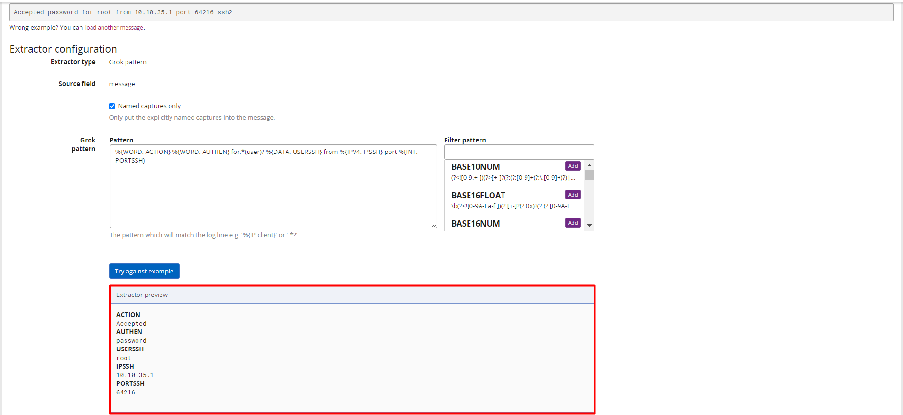

- Đặt tên cho `Extractor` và bấm `Create extractor` để khởi tạo Extract cho input này. 

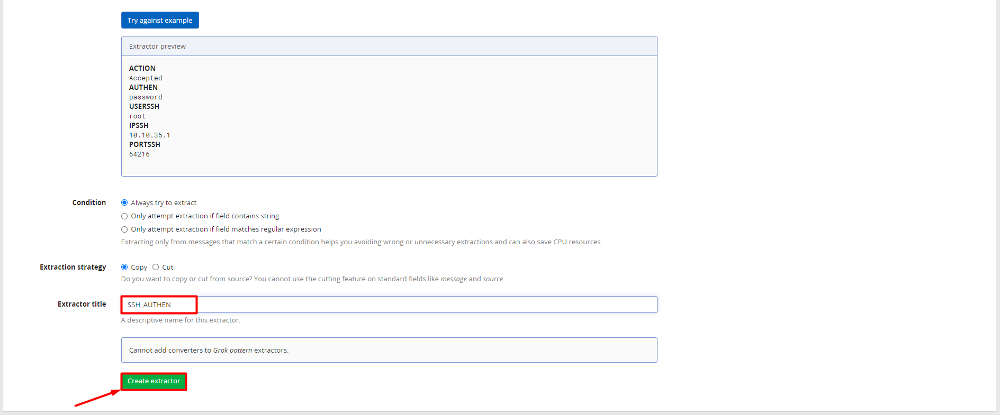

## 2. Sử dụng Grok mẫu và quản lý Extractor.

## 2.1 Sử dụng Grok mẫu để phục vụ quá trình extract

Vào `System/Grok Patterns`, tại đây sẽ hiện ra cửa sổ quản lý các mẫu grok.

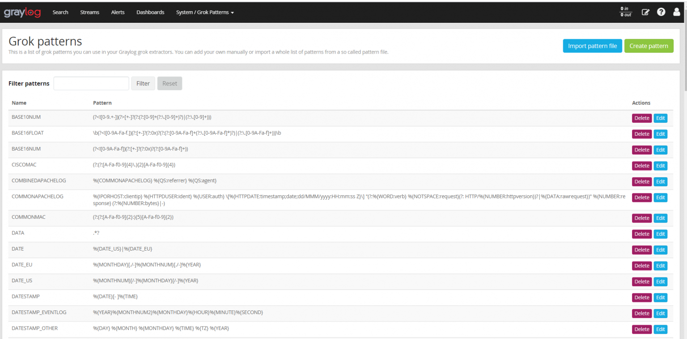

Các mẫu grok này sử dụng trong quá trình Grok Extractor, ta có thể chọn thêm thủ công 1 pattern hoặc sử dụng các pattern có sẵn để việc extract trở nên dễ dàng và thuận tiện nhất.

Cũng có thể sử dụng tính năng import để tải lên 1 mẫu grok có sẵn từ các nguồn khác.

Để import 1 pattern, kích vào `Import pattern file`.

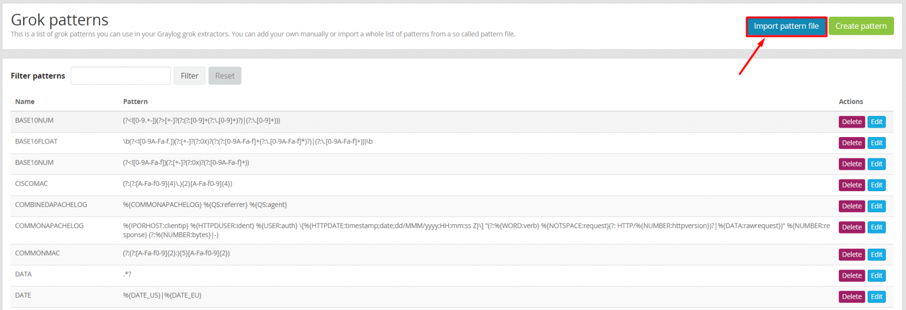

Trong phần lab này mình sẽ chỉ giới thiệu về Import thôi mà không đi sâu vào cách thực hiện. Chủ yếu mình dùng `Create pattern` để tạo thủ công để đi sâu vào mục đích sử dụng, nên phần này mình sẽ hướng dẫn tạo 1 pattern thủ công cụ thể là đối với log ssh.

Để tạo 1 pattern thủ công, kích vào `Create pattern` để tạo. Trong phần này mình sẽ hướng dẫn tạo pattern thủ công cho SSH để việc Extractor log ssh trở nên dễ dàng và thuận tiện hơn :

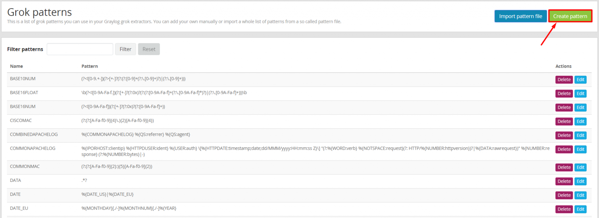

Ví dụ muốn tạo pattern dùng chung cho log ssh, ta nhập vào tên của pattern, sau đó nhập vào các kiểu dữ liệu để extract ra nhiều trường hoặc từng trường trong log ssh.

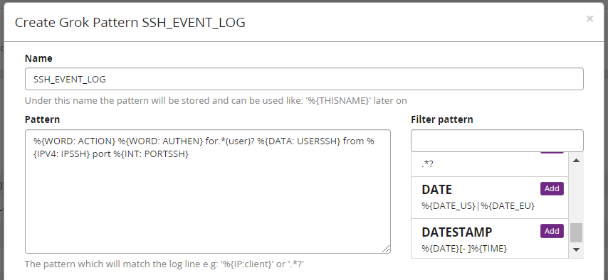

> Lưu ý:  
    -  Mục `Name` để nhập vào tên pattern  
    -  Mục `Pattern` sử dụng để nhập vào các pattern tương ứng với các trường trong bản tin ssh

```
%{WORD: ACTION} %{WORD: AUTHEN} for.*(user)? %{DATA: USERSSH} from %{IPV4: IPSSH} port %{INT: PORTSSH}
```
Đây là phần pattern chưa được định nghĩa cho các trường riêng, khi sử dụng để extract ta nên định nghĩa ( đặt tên) cho các trường mà mình mong muốn có được dữ liệu.

Sau đó nhập vào 1 đoạn dữ liệu mẫu và chọn `Test with Sample Data` để kiểm tra xem pattern khi exteract có hiển thị theo ý muốn hay không. Sau đó chọn `Save` để lưu lại.

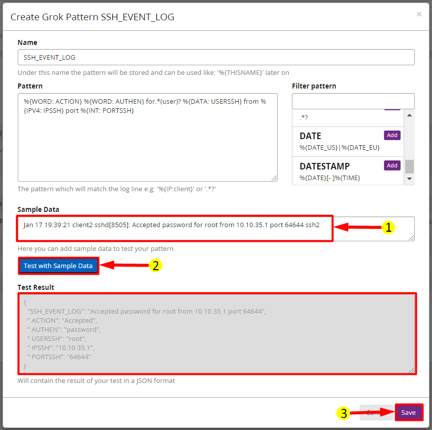

### 2.2 Giới thiệu về Manage extractors

- Để quản lý các Extractor đã tạo, ta vào `System/Inputs`. Tại đây sẽ có các loại Input, bấm Manage Extractor để quản lý Extractor cho từng loại đầu vào (Input).

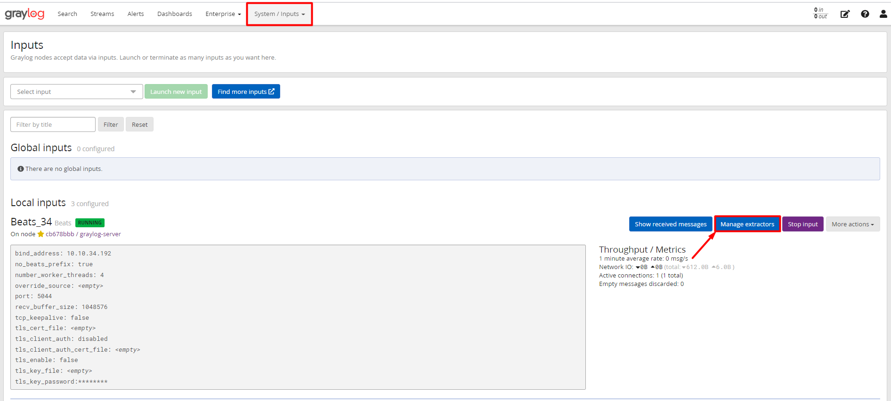

- Tại đây ta có thể chỉnh sửa các Extractor, xóa hoặc tải lên 1 Extractor sẵn có.

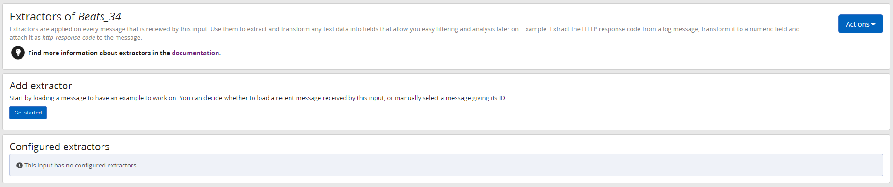

Để `Import` hoặc `Export` các Extractor, ta có thể kích vào Actions, sau đó có thể chọn `Import extractors` hoặc `Export extractors`. 

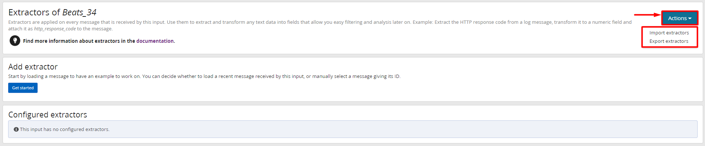

Như vậy mình đã hướng dẫn các bạn cách sử dụng cơ bản của Grok pattern để tạo 1 Extractor sử dụng cho log ssh. Có thể sử dụng chúng để tạo các Extractor cho nhiều loại log khác nhau.

Lưu ý: Mỗi `Input` quản lý các `Extractor` riêng, một `Extractor` của `Input` này không được áp dụng cho Input kia. Nên khi tạo `extract` cho log ssh hoặc các bản tin log khác, ta phải tạo các extract tương tự cho các input khác. 

Chúc các bạn thành công!
