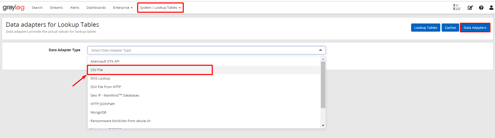

# Hướng dẫn sử dụng lookup tables trên graylog

Tính năng `lookup table` cho phép bạn `tra cứu`/`ánh xạ`/`dịch` các giá trị trường messages thành các giá trị mới và ghi chúng vào các trường message mới hoặc ghi đè các trường hiện có.

Ở bài này, mình sẽ sử dụng lookup table để ánh xạ các user ssh thành tên của người sở hữu user đó. 

Sau khi sử dụng grok patterns để extract bản tin ssh, ta có được trường `USERSSH` chứa thông tin user được sử dụng để ssh vào hệ thống. Từ đây, mình sẽ tạo 1 `lookup table` để ánh xạ các user với tên đầy đủ của người sở hữu user đó. 

Trước khi bắt đầu tạo lookup table cho `USERSSH`, bạn có thể tham khảo cách sử dụng grok patterns để extract dữ liệu với log ssh [tại đây](./7.Config_grok_pattern_in_graylog.md). 

## Cấu hình lookup table 

### Tạo Data Adapter

`Data Adapter` được sử dụng để thực hiện tìm kiếm thực tế cho một giá trị. Họ có thể đọc từ tệp CSV, kết nối với cơ sở dữ liệu hoặc thực thi các yêu cầu HTTP để nhận kết quả tra cứu.

- Ở mục `System` chọn `Lookup Tables` sau đó chọn `Data Adapter`: 


- Tiếp theo, chọn `Create data adapter` và chọn `Data Adapter Type` là `CSV File`: 




- Sau đó hãy điền các thông tin tương tự như sau: 


Trong đó: 

1. Nhập vào tiêu đề cho `data adapter`.
2. Mô tả ngắn cho `data adapter`.
3. Trong lookup table được chia thành 2 cột là key và value. Cột key được là phần chứa nội dung trường được extract từ message, value chứa nội dung sẽ được ánh xạ từ key. Nên ta đặt tên cho key
4. Đặt tên cho value
5. Chọn `Create Adapter` để tạo adapter. 

- Sau khi tạo ta sẽ có như sau: 


### Tạo Caches

`Caches` chịu trách nhiệm lưu vào bộ nhớ đệm kết quả tra cứu để cải thiện hiệu suất tra cứu và/hoặc để tránh quá tải cơ sở dữ liệu và API. Chúng là các thực thể riêng biệt để có thể sử dụng lại triển khai bộ đệm cho các bộ điều hợp dữ liệu khác nhau. Bằng cách đó, `data adapter` không phải quan tâm đến b`caches` và không phải tự triển khai nó.

- Chuyển sang tab `Caches` và kích chọn `Create cache`: 


- Chọn `Cache type` là `Node-local, in-memory cache`: 


- Sau đó điền các thông tin như sau: 


Trong đó: 

1. Đặt tiêu đề cho caches
2. Mô tả ngắn cho tiêu đề 
3. Kích vào `Create Cache` để tạo cache

### Tạo Lookup table

- Tiếp theo ta sẽ chuyển sang tab `Lookup Tables` và kích chọn `Create lookup table`: 


- Sau đó điền vào các thông tin sau: 


Trong đó: 

1. Đặt tiêu đề cho lookup table
2. Viết 1 mô tả ngắn cho lookup tables
3. Đặt 1 tên cho lookup table, không thể trùng với những tên đã tồn tại 
4. Chọn `Data Adapter` đã tạo cho lookup table như ở trên 
5. Chọn `Cache` đã tạo cho lookup table như ở trên 
6. Chọn `Create Lookup Table` như đã tạo ở trên 

- Sau khi tạo ta sẽ được như sau: 


### Tạo file CSV

- Truy cập vào terminal của graylog-server, tạo file csv:

```
touch /etc/graylog/lookup-table.csv
```

- Sau đó ta sử dụng `vi` hoặc `vim` để truy cập file và thêm vào nội dung tương tự như form sau: 

```
"user_ssh","full_name"
"root","Quan tri vien"
"user_a","Nguyen Van A"
"user_b","Nguyen Van B"
```
>Lưu ý: Phía trước dấu `,` là giá trị key và sau dấu `,` là `value`. Trong đó `key` lưu những giá trị được extract từ message log ssh và `value` lưu giá trị sẽ được sử dụng để thay thế cho giá trị `key`. 

## Tạo extractor

Trở lại web interface của graylog-server, tìm tới bản tin ssh để tạo extractor mới cho bản tin ssh. 

- Kích vào message chứa thông tin đăng nhập thành công. Ở trường user đã được extract ra trước đó là  `USERSSH` kích chọn nội dung của nó sẽ hiện lên các option của nó. Chọn `Create extractor` sẽ hiển thị lên 1 tùy chọn, hãy chọn `Lookup Table` và kích `Submit`.


- Sau khi được chuyển đến 1 cửa sổ mới, hãy điền các thông tin như sau: 


1. Chọn 1 lookup table sử dụng cho trường hợp này

2. Nhập vào tên cột sẽ được sử dụng khi search log

3. Nhập tiêu đề cho extractor này

4. Chọn `converter` là `Lookup Table`

5. Cuối cùng chọn `Create extractor` để tạo extractor mới.

Sau khi tạo extractor, quay lại cửa sổ search log để kiểm tra. 

Tại mục `Fields`, chọn 2 `fieled` để hiển thị trên table là `fullname_login_ssh` và `USERSSH`. 


Ta thấy rằng đối với các user ssh vào hệ thống, đã được chuyển thành tên đầy đủ của người sử dụng user đó. 

