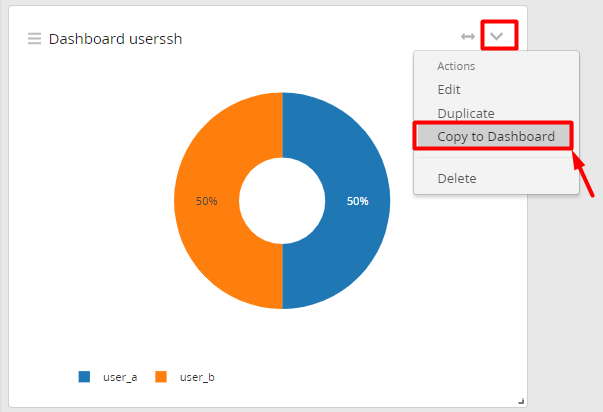

# Hướng dẫn cấu hình dashboards với log ssh

Tạo Dashboards để xem bản tin log 1 cách dễ dàng hơn khi dữ liệu được thống kê dưới dạng biểu đồ. 

Đầu tiên, để tạo Dashboards thống kê dữ liệu của bản tin ssh hoặc bất cứ bản tin nào khác, ta phải sử dụng extractor để tách các trường trong message log. Vì mình đã sử dụng extract để tách các trường ở phần trước rồi, nên tiếp theo mình chỉ việc tiếp tục sử dụng các trường đã được extract trước đó. Bạn có thể tham khảo cách để extract message log ssh [tại đây](7.Config_grok_pattern_in_graylog.md). 

## Thực hiện cấu hình

### Tạo dashboard

- Chọn tab `Dashboard` sau đó kích vào `Create dashboard` để tạo dashboard mới: 

- Chọn `Save as` để lưu dashboard: 

- Nhập vào tiêu đề và các mô tả cho dashboard rồi lưu lại: 

### Thêm dữ liệu vào dashboard

Với phần lab này, mình sẽ tạo dashboard để hiển thị số lần các user ssh failed và accepted trong 15 phút. 

Với trường `Failed` và trường `Accepted` của log ssh, trước đó ta đã đặt tên là `ACTION`. Đối với các user ssh, trước đó ta đã đặt tên là `USERSSH`.
Ở message log ssh, ta kích vào message chứa thông tin đăng nhập Failed hoặc Accepted. 

- Ở mục `Create` và chọn `Aggregation`: 

- Chọn mũi tên chỉ xuống và chọn `Edit`: 

- Chọn 1 số thông số để cấu hình dashboard cho `Action`:

1. Sửa tên mặc định của `Aggregation`
2. Chọn `VISUALIZATION TYPE`, ở đây mình dùng là `Pie Chart`
3. Ở mục `ROWS` ta sẽ chọn fields là `ACTION` để đếm các Action
4. Vì hành động là đếm nên ta chọn `METRICS` là `count()` 
5. Chọn `Save` để lưu lại cấu hình

- Chọn mũi tên chỉ xuống và chọn `Copy to dashboard` để lưu vào dashboard: 

- Chọn dashboard đã tạo trước đó là `Dashboard SSH` và chọn `Select`: 

- Chọn `Save` để lưu dashboard:

Tương tự như cách cấu hình trên, ta sẽ tiếp tục cấu hình 1 `Aggregation` để làm dashboard cho `USERSSH`. 

- Chọn `Copy to dashboard` để lưu vào dashboard: 

- Sau đó chọn dashboard đã tạo trước đó là `Dashboard SSH`, chọn `Select` sau đó chọn `Save` để lưu `dashboard`: 

Tiếp theo mình sẽ tạo dashboard sử dụng để đếm số lần ssh Accepted và Failed vào hệ thống. Có thể làm theo cách cũ như cấu hình ở trên nhưng tiếp theo, để tiện cấu hình và cấu hình nhanh hơn, mình sẽ sử dụng copy dashboard cũ và chỉnh sửa lại 1 số thông tin là được. 

- Ở mũi tên chỉ xuống của bất kỳ dashboard nào, chọn `Duplicate` để nhân đôi dashboard: 

- Ở tiêu đề dashboard là `copy`, ta kích vào mũi tên chỉ xuống và chọn `edit`: 

Đầu tiên ta sẽ cấu hình dashbaord cho log ssh `Accepted`. 

Ta nhập vào search query là: `ACTION: Accepted` và chọn ``VISUALIZATION TYPE` là `Single Number` để hiển thị dưới dạng số. Các trường `ROWS` và `METRICS` ta vẫn đặt là `ACTION` và `count()`. Sau đó chọn `Save` để lưu lại cấu hình. 

- Sửa lại tên để việc theo dõi được chính xác hơn. 

Tương tự, ta sẽ tạo cấu hình dashboard cho log ssh `Failed`. 

Sau khi cấu hình ta sẽ có dashboard để theo dõi thông tin về Action và user login của SSH như sau: 

Dashboard có nhiều kiểu hiển thị đa dạng để thống kê dữ liệu, hãy thử các kiểu thống kê dữ liệu khác nhé. Chúc các bạn thành công !! 