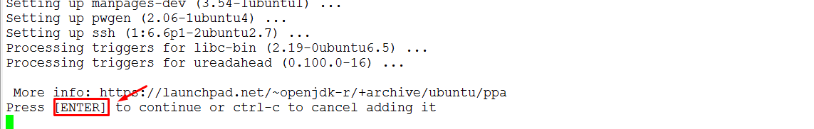
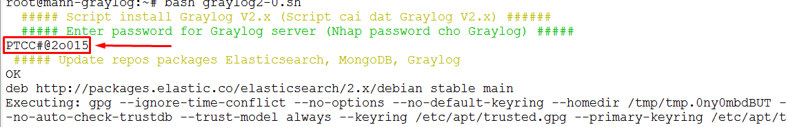
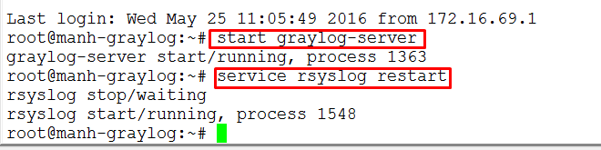

### Ghi chép hướng dẫn cài đặt graylog 2.x

### INFO
```sh
# Graylog V2.0.1
# Elasticsearch 2.
# MongoDB 
# Ubuntu 14.04.2
# Update: 25/5/2016
```

#### DIAGRAM LAB
*** 


####Cách cài đặt

 - Với Graylog Server
 
 ```sh
 wget https://raw.githubusercontent.com/hocchudong/ghichep-graylog/master/graylog/graylog-scripts/graylog2-0.sh
 ```
 - Với Client
 ```sh
 wget https://raw.githubusercontent.com/hocchudong/ghichep-graylog/master/graylog/graylog-scripts/graylog-collector.sh
 ```
 
 #####Một số *lưu ý* khi chạy script:
 
 - Nhập password cho admin khi đăng nhập vào Web-interface
 

 - Ấn phím *ENTER* để tiếp tục
 

 - Sau khi Reboot lại máy, khởi động Graylog và restart rsyslog
 

 - Tạo các Input cơ bản để nhận dữ liệu từ Client và từ chính Graylog-server
 
 
 
 
####Các tham khảo
  - Sử dụng Web-Interface: 
```sh
https://github.com/hocchudong/ghichep-graylog/blob/master/graylog/graylog-web%20interface/Graylog-Interface.md)
```
  - Cấu hình cho Graylog Collector:
```sh
https://github.com/hocchudong/ghichep-graylog/tree/master/graylog/graylog-collector
```
