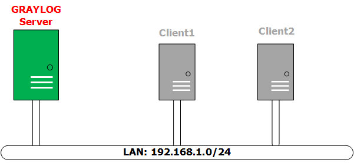
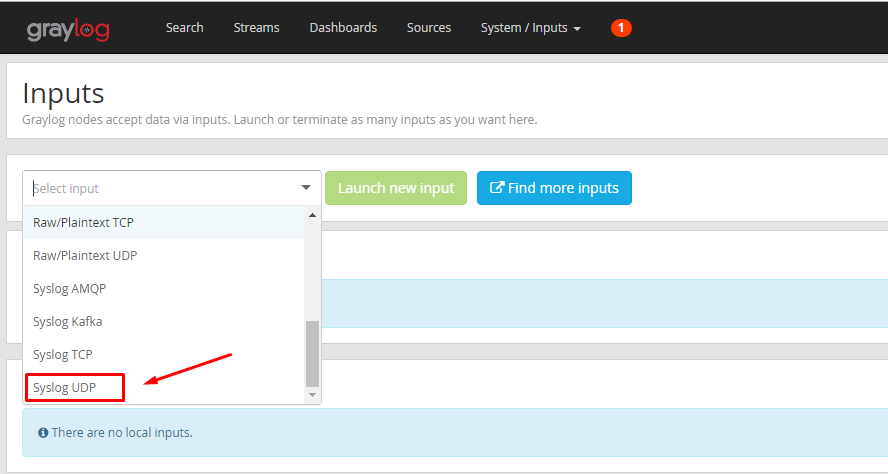

### Ghi chép hướng dẫn cài đặt graylog 2.x

### INFO
```sh
# Graylog V2.0.1
# Elasticsearch 2.3.3
# MongoDB 2.6.12
# Ubuntu 14.04.2
# Update: 25/5/2016
```

#### DIAGRAM LAB
*** 


####Cách cài đặt
 - Cấu hình tối thiểu yêu : RAM 2GB, CPU = 2 Core.
 
 - Với Graylog Server
 
 ```sh
 wget https://raw.githubusercontent.com/hocchudong/ghichep-graylog/master/graylog/graylog-scripts/graylog2-0.sh
 ```
 - Với Client
 ```sh
 wget https://raw.githubusercontent.com/hocchudong/ghichep-graylog/master/graylog/graylog-scripts/graylog-collector.sh
 ```
 
 #####Một số *lưu ý* khi chạy script:
 
 - Nhập password cho admin khi đăng nhập vào Web-interface
 
 

 - Ấn phím *ENTER* để tiếp tục
 
 

 - Sau khi Reboot lại máy, khởi động Graylog và restart rsyslog
 

 - Tạo các Input cơ bản để nhận dữ liệu từ Client và từ chính Graylog-server
 
 
 
 
 
*Lưu ý* : Với Graylog 2.0 ,  Graylog-Collector không còn được sử dụng.
####Các tham khảo
 - [Sử dụng Web-Interface] (https://github.com/hocchudong/ghichep-graylog/blob/master/graylog/graylog-web%20interface/Graylog-Interface.md)
 
 
 - [Một số tính năng mới của Graylog2.0](https://github.com/hocchudong/ghichep-graylog/blob/master/graylog/Graylog%202.0%20-%20Nh%E1%BB%AFng%20t%C3%ADnh%20n%C4%83ng%20m%E1%BB%9Bi.md)

 
### Các lưu ý: 
1. Config Web-Interface đối với tình huống truy cập vào máy chủ LOG thông qua IP Public được NAT ra bên ngoài:

- Giải sử máy chủ LOG có IP Private là `172.17.77.241/24`, được NAT qua IP Public `203.168.11.20`. Lúc này ta muốn truy cập từ bên ngoài vào web của Graylog thông qua địa chỉ `203.168.11.20`

- Sửa file `/etc/graylog/server/server.conf`  để chứa các dòng sau (một phần trong khai báo):
    
    ```sh
    ... các dòng khác
    
    rest_listen_uri = http://0.0.0.0:12900/
    rest_transport_uri = http://172.17.77.241:12900/
    web_enable = true
    web_listen_uri = http://0.0.0.0:9000/
    web_endpoint_uri = http://203.168.11.20:12900
    
    ... các dòng khác
    ```
    
- File `/etc/elasticsearch/elasticsearch.yml` có nội dung như sau
    
    ```sh
    root@cong-u14-ctl:# cat /etc/elasticsearch/elasticsearch.yml | egrep -v '^#|^$'
    ```
    
    ```sh
    cluster.name: graylog
    discovery.zen.ping.unicast.hosts: ["127.0.0.1"]
    ```

