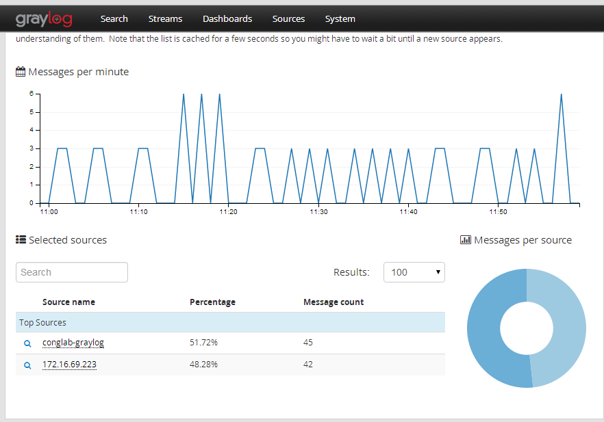

# Script install GRAYLOG V.1.3

### INFO
```sh
# Graylog V1.3
# Elasticsearch 1.7
# MongoDB 2.6.11
# Ubuntu 14.04.2
# Update: 13/03/2016
```

#### DIAGRAM LAB
*** 


#### How to execute
*** 
- Graylog on Server 
```sh
wget https://raw.githubusercontent.com/hocchudong/log-script/master/graylog/graylog-server.sh
bash graylog-server.sh

```

- Graylog for client 1 (Ubuntu)
```sh
wget https://raw.githubusercontent.com/hocchudong/log-script/master/graylog/graylog-client-ubuntu.sh
bash graylog-client-ubuntu.sh
```

#### User Guide for Graylog WEB
***





